---
# You can also start simply with 'default'
theme: seriph
# random image from a curated Unsplash collection by Anthony
# like them? see https://unsplash.com/collections/94734566/slidev
background: https://cover.sli.dev
# some information about your slides (markdown enabled)
title: Welcome to Slidev
info: |
  ## Slidev Starter Template
  Presentation slides for developers.

  Learn more at [Sli.dev](https://sli.dev)
# apply unocss classes to the current slide
class: text-center
# https://sli.dev/features/drawing
drawings:
  persist: false
# slide transition: https://sli.dev/guide/animations.html#slide-transitions
transition: slide-left
# enable MDC Syntax: https://sli.dev/features/mdc
mdc: true

fonts:
  # basically the text
  sans: Robot
  # use with `font-serif` css class from UnoCSS
  serif: Robot Slab
  # for code blocks, inline code, etc.
  mono: Fira Code
---

# Introduction to LLMs and Their Applications

ZEYU LYU

  Press Space for next page <carbon:arrow-right />

 
  <button @click="$slidev.nav.openInEditor" title="Open in Editor" class="slidev-icon-btn">
    <carbon:edit />
  </button>
  <a href="https://github.com/lvzeyu/Tohoku_AIE_PBL" target="_blank" class="slidev-icon-btn">
    <carbon:logo-github />
  </a>

<!--
The last comment block of each slide will be treated as slide notes. It will be visible and editable in Presenter Mode along with the slide. [Read more in the docs](https://sli.dev/guide/syntax.html#notes)
-->

---
transition: fade-out
---

# Overview of Lectures

LLMs Basics

<v-clicks depth="2">

- **Lecture 1**

    - 💡 High-level explanations of the fundamental concepts behind LLMs
    - ⭐️ Insights into the transformer architecture
    - 🧑‍💻 Application of LLMs using Transformers library and HuggingFace Hub

- **Lecture 2**

    - 📝 Prompting and In-context Learning of LLMs
    - 🔧 Fine-tuning LLMs

- **Lecture 3** 
   
    - 🤖 Applications of LLMs Agents

</v-clicks>

 

---
transition: slide-up
level: 2
---

# LLMs Basics

Journey of Language Models

  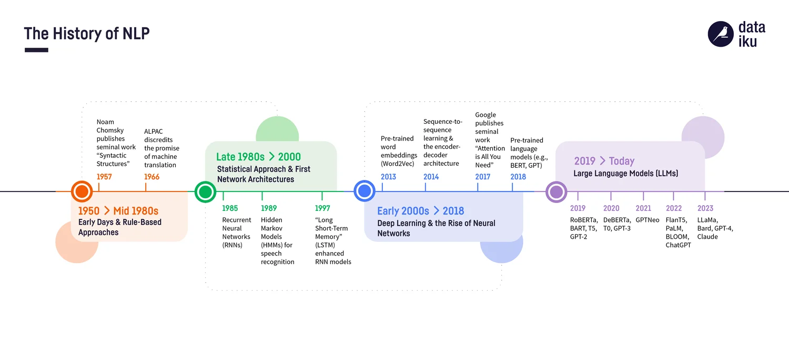

<!--
自然言語処理（NLP）は、コンピュータが人間の言語を理解、生成、分析するための一連の技術です。文章などのテキストコンテンツはすべて非構造化データに分類されます。コンピュータにとって、この種のデータは表やデータベースのように明確な構造や規則を持たないため、処理が非常に困難です。

自然言語技術の発展の初期段階では、隠れマルコフモデル（HMM）、線形サポートベクターマシン（SVM）、ロジスティック回帰などの統計的機械学習の手法が主流でした。

これらの手法の特徴は、人間が手動で特徴量を設計する必要があることです。つまり、まずモデルに「どの単語が重要か」「どのような構造が意味を持つか」を教え、その上でモデルに規則性を学習させる必要がありました。

この種の手法は小規模なタスクでは非常に有効でしたが、今日のような大規模で複雑性の高い言語データに直面すると、技術的なボトルネックが露呈することが多くありました。

2010年代に入ると、ディープラーニング技術のブレークスルーが自然言語処理の分野に新たな発展の契機をもたらしました。ディープラーニングは、人間による特徴量設計に依存せず、生のテキストから直接表現（representation）を自動的に学習するため、複雑な言語タスクを処理する能力が著しく向上しました。

2018年、Googleは画期的なモデルであるBERTを発表しました。これは、まず大規模なコーパスで汎用的な言語能力を「事前学習」し、その後、具体的なタスクに応じて「ファインチューニング」を行うものです。この「事前学習-ファインチューニング」という開発パラダイムは、NLPモデルの構築方法を根本的に変え、訓練コストを大幅に削減し、タスク間の転移能力も向上させました。この段階から、NLPモデルは文脈を理解し、前後の意味を捉える能力を備えるようになり、より複雑な推論、質疑応答、感情認識などのタスクを処理できるようになりました。

2019年以降はGPT、T5など、様々なバリエーションが登場し、より大規模なデータセットで事前学習され、性能が飛躍的に向上しました。LLMは、パラメータ数と学習データの規模を拡大することで、驚くべき能力を発揮するようになりました。数千億、さらには兆単位のパラメータを持つモデルが登場し、これにより、より複雑な推論、多言語対応、プログラミングコードの生成、創造的な文章作成など、幅広いタスクで人間レベル、あるいはそれを超える性能を示すようになりました。
-->

---
transition: slide-up
level: 2
---

# LLMs Basics

What is LLMs?

<v-clicks depth="2">

- LLMs are deep neural networks trained on massive amounts of text data, designed to understand, generate, and respond to human-like text.
    - ***Large* refers to both the model's size in terms of parameters and the dataset**
        - LLMs often involves billions of parameters
        - LLMs were trained on a large amount of texts
    - **LLMs are capable of *generating text***
        - LLMs are often referred to as a form of generative AI.
        - LLMs can handle various task including answering questions, writing essays, translating languages through text generation
    - **LLMs utilize an architecture called the *Transformer***
        - Transformer  enables efficient processing of language by capturing complex patterns and relationships across long text sequences

</v-clicks>

<!--
大規模なテキストデータで訓練された深層ニューラルネットワーク: LLMは、インターネット上の膨大な書籍、記事、ウェブサイトなど、あらゆる種類のテキストデータを学習しています。この「大規模さ」が、人間のようなテキストを理解し、生成し、応答する能力の基盤となっています。

「大規模（Large）」の意味:

パラメータ数: モデルの内部構造を構成する「パラメータ」の数が非常に多いことを指します。数億、数十億、さらには数兆に及ぶパラメータを持つモデルも存在します。パラメータが多いほど、より複雑なパターンや関係性を学習できます。
訓練データセット: 学習に用いられるテキストデータの量が膨大であることを指します。これにより、多様な言語表現や知識を獲得します。
テキスト生成能力（Generative AI）: LLMは、与えられたプロンプトや文脈に基づいて、新しいテキストを生成する能力に優れています。そのため、「生成AI（Generative AI）」の一種として広く認識されています。文章作成、要約、翻訳、コード生成など、多岐にわたるテキスト生成タスクを実行できます。

Transformerアーキテクチャの利用: LLMのほとんどは、「Transformer（トランスフォーマー）」と呼ばれる特別なニューラルネットワークアーキテクチャを基盤としています。Transformerは、テキスト内の単語間の関係性（文脈）を効率的に捉えることができるため、長文の理解や生成において非常に高い性能を発揮します。BERTやGPTといった有名なモデルも、このTransformerアーキテクチャを採用しています。

要するに、LLMは膨大なテキストデータから学習し、Transformerという効率的な構造を使って、人間のようにテキストを理解し、そして創造的にテキストを生成する能力を持つ、非常に大規模なAIモデルであると言えます。 
-->

---
transition: slide-up
level: 2
---

# LLMs Basics

What is GPT?

<v-clicks depth="2">

- G: **G**enerative model
    - GPT are trained to predict the next word in a sequence
- P: **P**re-trained
    - GPT models undergo an extensive training phase on a massive dataset of text
    - Pre-trained allows model to learn a vast amount of linguistic patterns, facts, reasoning abilities, and general knowledge.
- T: **T**ransformer
    - GPT models are built on the Transformer architecture

</v-clicks>

---
transition: slide-up
level: 2
---

# LLMs Basics

Language Models(LMs)

- LMs  designed to understand and generate human language by assigning probabilities to sequences of words
    - **Setup**: Assume a vocabulary of words  
  $$
  V = \{W_1, W_2, W_3, \ldots, W_n\}
  $$

    - **Data**: Given a training set of example sentences

    - **Goal**: Estimate a probability distribution  
  $$
  \sum_{x \in V^{*}} p(x) = 1
  $$

<!--
Language Models (LMs)は、人間の言語を理解し生成するために、単語のシーケンスに確率を割り当てるように設計されたモデルです。

ある単語の後にどのような単語が続くか、あるいはある単語の並び全体がどれくらいの確率で発生するかを数学的にモデル化します。これにより、言語の規則性やパターンを学習し、新しいテキストを生成したり、既存のテキストの妥当性を評価したりすることが可能になります。

- 言語モデルが扱うことのできるすべてのユニークな単語の集合を用意します。
- 訓練セットの例文: このデータから、どの単語がどの単語の後に現れることが多いか、どのような単語の並びが自然か、といった情報を抽出します。
- 目標は確率分布の推定: 言語モデルの究極の目標は、可能なすべての単語のシーケンスに対する確率分布$p(x)$を推定することです。語彙 V から構成されるすべての可能な単語のシーケンスの集合を表します。この式は、すべての可能な単語シーケンスの確率を合計すると1になる。つまり、モデルはあらゆる単語の並びに対して、それがどれだけ「ありそうか」という確率を割り当てることができるようになることを目指します。
-->

---
transition: slide-up
level: 2
---

# LLMs Basics

Next-word Prediction Task

  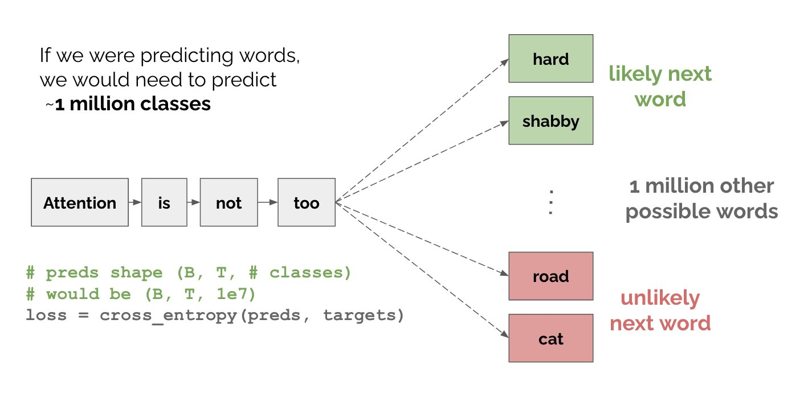

---
transition: slide-up
level: 2
---

# LLMs Basics

Text Generation

  

---
transition: slide-up
level: 2
---

# LLMs Basics

Transformer

<v-clicks depth="2">

- The Transformer has significantly advanced the field of NLP and is applied across a wide range of large language models.
- **Self-attention** mechanism allows the model to compute the relevance of each element in a sequence and use this information to understand the context. 
    - Handling of **Long-Range Dependencies**
    - **Parallelization** for training truly "large" language models
</v-clicks>

  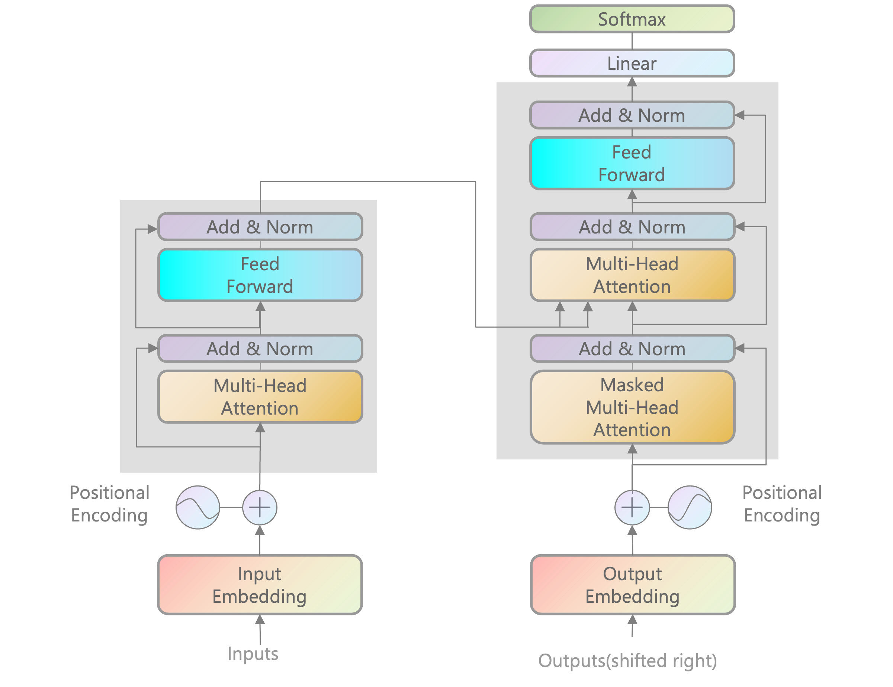

---
transition: slide-up
level: 2
---

# LLMs Basics

Seq2seq

<v-clicks depth="2">

- The Transformer is a type of **Seq2seq (Sequence-to-Sequence)** model
- A Seq2Seq model is an architecture designed to transform an input sequence into an output sequence

    - **Encoder**: Process the input sequence and compress its information into a fixed-size representation called the context vector
    
    - **Decoder**: Use encoded information (context vector) to generate the output sequence.

</v-clicks>

  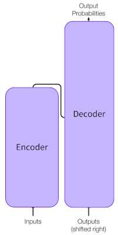

<!--
TransformerはSeq2Seq (Sequence-to-Sequence) モデルの一種である.

Seq2Seqモデルは、入力シーケンスを出力シーケンスに変換するように設計されたアーキテクチャである

- 従来のSeq2Seqモデル（リカレントニューラルネットワーク (RNN) や畳み込みニューラルネットワーク (CNN) をベースとしたもの）とは異なる、より効率的で高性能なメカニズム（自己注意機構など）を採用している点が特徴です。

- Encoder (エンコーダ):入力シーケンスを処理し、その情報を固定サイズの表現（コンテキストベクトル）に圧縮する エンコーダの役割は、入力された文章やデータ全体の意味内容を捉え、それをデコーダが利用できる形に変換することです。この「固定サイズの表現」は、入力シーケンスのすべての重要な情報が凝縮されたものと見なされます。従来のSeq2Seqモデルでは、リカレントニューラルネットワークの最後の隠れ状態がコンテキストベクトルとして使われることが多かったです。
Decoder (デコーダ):

- エンコードされた情報（コンテキストベクトル）を使用して出力シーケンスを生成する デコーダは、エンコーダが作成したコンテキストベクトルを基に、ターゲット言語や目的とする出力形式で単語を一つずつ生成していきます。生成の際には、それまでに生成された単語も考慮に入れ、文脈に合った次の単語を選択します。
-->

---
transition: slide-up
level: 2
---

# LLMs Basics

Seq2seq

<video controls width="700" style="display: block; margin-left: auto; margin-right: auto;">
  <source src="./image/seq2seq_training_with_target.mp4" type="video/mp4">
</video>

---
transition: slide-up
level: 2
---

# LMs before the Transformer

N-gram Language Model

- **🔁 Markov assumption**: The probability of a word depends only on the previous \( N-1 \) words.  
  $$
  P(w_n \mid w_{1:n-1}) = P(w_n \mid w_{n-N+1:n-1})
  $$

- For a sentence *students opened their __[blank]__*  
  $$
  P(w) = \frac{\text{count(opened their } w)}{\text{count(opened their)}}
  $$

<v-clicks depth="2">

- An N-gram is a contiguous sequence of $N$ items from a given text.
- N-gram language model refers to a probabilistic model that can estimate the probability of a word given the $n-1$ previous words.
</v-clicks>

  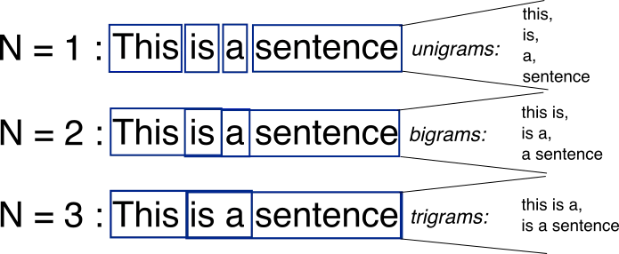

<!--
マルコフ仮定 (Markov assumption): 

$$P(w_n \mid w_{1:n-1}) = P(w_n \mid w_{n-N+1:n-1})$$
この仮定は、N-gramモデルの根幹をなすものです。
- 左辺 $P(w_n \mid w_{1:n-1})$ は、「現在の単語 $w_n$ の確率が、その前に現れたすべての単語 $w_1, \ldots, w_{n-1}$ に依存する」という理想的な（しかし計算が非常に困難な）状況を示します。
- 右辺 $P(w_n \mid w_{n-N+1:n-1})$ は、「現在の単語 $w_n$ の確率は、その直前の $N-1$ 個の単語 $w_{n-N+1}, \ldots, w_{n-1}$ のみに依存する」という簡略化された仮定です。

つまり、**過去のすべての文脈を考慮するのではなく、直近の一定数の単語のみを文脈として考慮する**という考え方です。この「一定の数」が $N-1$ です。$N$ の値が大きいほど、より多くの文脈を考慮できますが、モデルの複雑性とデータスパース性の問題が増大します。

$$P(w) = \frac{\text{count(opened their } w)}{\text{count(opened their)}}$$

これは、**3-gram（またはTrigram）モデル** の場合の例です。この式は、空白に当てはまる単語 $w$ が来る確率を計算しています。

- $\text{count(opened their } w)$ は、学習データ中に「opened their」の後に特定の単語 $w$ が続く回数を示します。例えば、「opened their books」というフレーズが何回出現したか。
- $\text{count(opened their)}$ は、学習データ中に「opened their」というフレーズが何回出現したかを示します。

したがって、この式は、**「opened their」という文脈が与えられたときに、次に単語 $w$ が続く条件付き確率** を推定しています。
-->

---
transition: slide-up
level: 2
---

# LMs before the Transformer

N-gram Language Model

<v-clicks depth="2">

- ⚠️Computational complexity 
    - As $N$ increases (to capture more context), the number of possible unique N-grams grows exponentially with the size of the vocabulary. 
    - Example: For a vocabulary of 50,000 words, a 5-gram model would theoretically need to store $(50,000)^5$ counts

- ⚠️Low generalization 
    - Language often has dependencies that span many words: The fixed-size context is a fundamental limitation.
    - Inability to capture long-range dependencies means N-gram models cannot truly understand the deep syntactic or semantic relationships in sentences.
</v-clicks>

<!--

- **⚠️ 計算上の複雑性 (Computational complexity)**
    - **$N$が増加すると（より多くの文脈を捉えるため）、可能なユニークなN-gramの数が語彙サイズに対して指数関数的に増加する。**
        これはN-gramモデルの最も深刻な問題の一つです。N-gramは基本的に、訓練データ中に現れる連続する単語の並び（N-gram）の頻度を数え上げて確率を推定します。$N$が大きくなると、考えられる単語の組み合わせが爆発的に増えるため、次の問題が生じます。
    - **例：語彙サイズが50,000語の場合、5-gramモデルは理論上 $(50,000)^5$ のカウントを保存する必要がある。**
        これは $3.125 \times 10^{23}$ という天文学的な数字になります。現実的には、学習データに存在するN-gramのみを保存しますが、それでもその数は膨大になり、以下の問題を引き起こします。
        * **メモリとストレージの消費:** 膨大な数のN-gramとそのカウントを保存するために、途方もない量のメモリとストレージが必要になります。
        * **計算時間:** 確率の計算や更新に時間がかかります。
        * **データスパース性 (Data Sparsity):** これが最も大きな問題です。たとえ学習データが大きくても、$N$が大きくなると、ほとんどのN-gramの組み合わせは一度も出現しない（カウントがゼロになる）可能性が高まります。この問題は「ゼロ頻度問題」と呼ばれ、N-gramモデルの汎化能力を著しく低下させます。例えば、「unusual blue car」というフレーズが訓練データになくても、個々の単語は頻繁に現れるかもしれません。しかし、3-gramモデルではそのフレーズの確率はゼロと評価されてしまいます。これを緩和するために、スムージング（平滑化）などの手法が用いられますが、根本的な解決にはなりません。

- ⚠️ 汎化能力の低さ (Low generalization)
    - **言語はしばしば、多くの単語にまたがる依存関係を持つ：固定サイズの文脈は根本的な制限である。**
        N-gramモデルはマルコフ仮定に基づいているため、$N-1$個の直前の単語しか考慮しません。これは、文章全体の意味や文法構造を理解する上で致命的な制約となります。例えば、以下のような文を考えてみましょう。
        「太郎が、昨日公園で遊んでいた花子に、話しかけた。」
        この文では、「太郎」という主語が「話しかけた」という動詞に対応しており、両者の間には多くの単語が挟まっています。しかし、N-gramモデルは $N-1$ の窓を超えた依存関係を捉えることができません。
    - **長距離依存関係を捉える能力がないことは、N-gramモデルが文中の深い統語的（構文的）または意味的関係を真に理解できないことを意味する。**
        これは上記の点と関連しています。人間が言語を理解する際には、文頭から文末まで、あるいは段落全体といった広範囲の文脈を考慮して意味を解釈します。N-gramモデルはこのような長距離の依存関係（long-range dependencies）を扱うことができないため、文法的に正しいが意味的に不自然な文章を生成したり、複雑な質問応答や要約といったタスクで苦戦したりします。
-->

---
transition: slide-up
level: 2
---

# Language Model with RNNs

Recurrent Neural Networks (RNNs)

<v-clicks depth="2">

- Compute an output $y_t$ for an input $x_t$ requires activation value for the hidden layer $h_t$.
    - $h_t$ is calculated based on the input $x_t$ and the hidden layer from the previous time step $h_{t-1}$.
</v-clicks>

  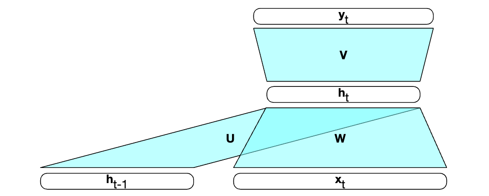

<v-clicks depth="2">

- Computation at time $t$ requires the value of the hidden layer from time $t − 1$ mandates an incremental inference algorithm that proceeds from the start of the sequence to the end. 
</v-clicks>

  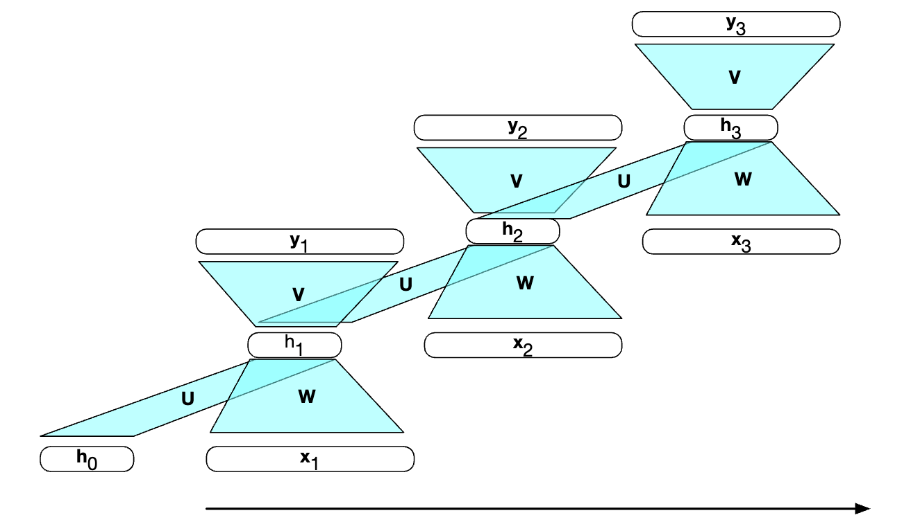

<!--

リカレントニューラルネットワーク（RNNs）は、シーケンスデータを扱うために設計されたニューラルネットワークの一種で、言語モデルの分野で大きな進歩をもたらしました。

* **入力 $x_t$ に対して出力 $y_t$ を計算するには、隠れ層の活性化値 $h_t$ が必要である。**
    * **$h_t$ は、入力 $x_t$ と前のタイムステップの隠れ層 $h_{t-1}$ に基づいて計算される。**

    この2つの点は、RNNの最も重要な特徴である「再帰性（Recurrence）」と「記憶（Memory）」を説明しています。

    * **$x_t$**: 現在のタイムステップ（時刻 $t$）における入力データです。言語モデルの文脈では、これは通常、現在の単語の埋め込み（単語ベクトル）に相当します。
    * **$y_t$**: 現在のタイムステップにおける出力です。言語モデルでは、次に続く単語の確率分布や、現在の単語が何であるかの予測などになります。
    * **$h_t$**: 現在のタイムステップにおける「隠れ状態（hidden state）」または「隠れ層の活性化値」です。これは、**これまでのすべての入力シーケンス（$x_1, \ldots, x_t$）の情報を集約した「記憶」** のような役割を果たします。
    * **$h_{t-1}$**: 前のタイムステップ（時刻 $t-1$）の隠れ状態です。$h_t$ の計算に $h_{t-1}$ が含まれることで、ネットワークは過去の情報を現在の処理に「再帰的に」利用できるようになります。

* **RNNの利点:** RNNは、隠れ状態 $h_t$ を介して過去のすべての情報を「記憶」し、それを現在の計算に利用します。理論的には、シーケンスの最初からの情報を保持し続けることができ、これによりN-gramでは不可能だった**長距離依存関係**を学習し、より深い文脈を理解することが可能になります。これにより、より文法的に正しく、意味的に一貫した文章を生成したり、複雑な意味理解を伴うタスクを処理したりできるようになります。

 **N-gramの限界:** N-gramは固定長のウィンドウでしか文脈を表現できません。Nを大きくすると、計算量とデータスパース性の問題が爆発的に増加します。
    * **RNNの利点:** RNNは、隠れ状態を通じて可変長の文脈を動的に表現します。これにより、単語の出現パターンだけでなく、文の構造や意味といったより抽象的な特徴を学習できます。N-gramのように $N$ を増やすことによる計算量の爆発的な増加やデータスパース性の問題に悩まされることが少なくなります。

* **時刻 $t$ における計算には、時刻 $t-1$ における隠れ層の値が必要であるため、シーケンスの先頭から最後まで処理を進める逐次的な推論アルゴリズムが必須となる。**

    これはRNNのもう一つの重要な特性であり、同時に大きな制約でもあります。
    * **逐次的な計算 (Sequential Computation):** 各タイムステップの計算は、前のタイムステップの計算結果に依存するため、並列化が非常に困難です。これは、特に長いシーケンスを扱う場合に、訓練や推論の速度が遅くなる原因となります。
    * **情報のフロー:** 隠れ状態が次々に更新されていくことで、理論的にはシーケンスの最初からの情報を「記憶」し続けることができます。これにより、N-gramモデルの固定長の文脈の制約を乗り越え、長距離依存関係をある程度捉えることが可能になりました。しかし、実際には、勾配消失・爆発問題により、非常に長いシーケンスの初めの情報を保持し続けることは困難でした（この問題はLSTMやGRUによって緩和されました）。

まとめると、RNNは「記憶」を持つことでN-gramモデルの課題を克服し、より自然な言語処理を可能にしましたが、その逐次的な性質ゆえに計算効率と非常に長い文脈の扱いに限界がありました。これが、Attention機構やTransformerといった、より並列化に適したアーキテクチャが登場する背景となります。
-->

---
transition: slide-up
level: 2
---

# Language Model with RNNs

Recurrent Neural Networks (RNNs)

<v-switch>
      <template #1>
        
      </template>
      <template #2>
        
      </template>
      <template #3>
        
      </template>
      <template #4>
        
      </template>
      <template #5>
        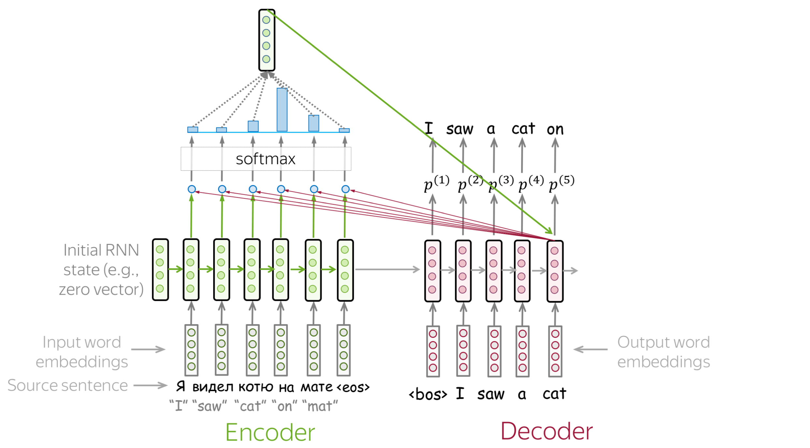
      </template>
      <template #6>
        
      </template>
      <template #7>
        
      </template>
      <template #8>
        
      </template>
    </v-switch>

---
transition: slide-up
level: 2
---

# Language Model with RNNs

Recurrent Neural Networks (RNNs)

<v-clicks depth="2">

- Advantages of RNN LMs
    - **Contextual Understanding**: RNNs can capture longer dependencies in the text when making predictions.
    - **Dynamic Computation**: RNNs can handle input sequences of varying lengths without needing to predefine a fixed size.
- Disadvantages of RNN LMs: In a encoder-decoder model with RNNs LMs, the hidden state of the last time step represents absolutely everything about the meaning of the source text.
    - Sequential nature of RNNs means recurrent computation is slow.
    - Information at the beginning of the sentence, especially for long sentences, may not be equally well represented in the context vector.

</v-clicks>

  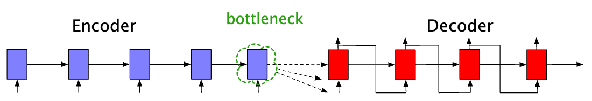

<!--

**RNNを用いた言語モデルの利点 (Advantages of RNN LMs)**

1.  **文脈理解 (Contextual Understanding):**
    * **RNNsは、予測を行う際にテキスト中のより長い依存関係を捉えることができる。**
        これはN-gramモデルとの最大の差別化ポイントです。RNNは、隠れ状態（$h_t$）を通じて過去の情報を「記憶」し、それを現在の単語の予測に利用します。理論上は、シーケンスの任意の長さの情報を保持できるため、文の最初に出てきた単語が文の後半の単語の意味に影響を与えるような「長距離依存関係」をN-gramよりもはるかにうまく捉えることができます。これにより、より文脈に即した、自然で一貫性のあるテキストを生成したり、複雑な意味を持つ文章を理解したりすることが可能になります。

2.  **動的な計算 (Dynamic Computation):**
    * **RNNsは、固定サイズを事前に定義することなく、可変長の入力シーケンスを処理できる。**
        N-gramモデルは、特定の $N$ の値（例：3-gramなら3単語）に固定されます。しかし、RNNは逐次的に処理を進めるため、入力されるシーケンスの長さがいくらであっても、その長さに応じて計算を継続できます。これにより、文章の長さが不揃いな実際の言語データに柔軟に対応でき、機械翻訳のように異なる長さの文を扱うタスクにも自然に適用できます。

**RNNを用いた言語モデルの欠点 (Disadvantages of RNN LMs)**

1.  **情報の圧縮とボトルネック (Information Compression and Bottleneck):**
    * **RNNを用いたエンコーダ・デコーダモデルにおいて、最後のタイムステップの隠れ状態がソーステキストのあらゆる意味を完全に表現することになる。**
        これは、RNNベースのSeq2Seqモデルにおける**コンテキストベクトル（または固定サイズ表現）のボトルネック問題**を指しています。エンコーダは入力シーケンス全体を読み込み、その情報を単一の隠れ状態ベクトル（通常は最後の隠れ状態）に「圧縮」します。この単一ベクトルが、デコーダがターゲットシーケンスを生成するために使用できる唯一の情報源となります。
        * **問題点:** 特に長い入力シーケンスの場合、すべての重要な情報を一つの固定サイズのベクトルに凝縮することは非常に困難です。情報が失われたり、重要な情報が薄まったりする可能性があります。これは、長い文を理解したり、詳細な情報を保持したりする能力を制限します。

2.  **逐次的な性質による計算の遅さ (Slow Computation due to Sequential Nature):**
    * **RNNの逐次的な性質は、再帰的な計算が遅いことを意味する。**
        RNNの各タイムステップの計算は、前のタイムステップの計算結果に強く依存します。つまり、$h_t$ を計算するには $h_{t-1}$ が必要であり、$h_{t-1}$ を計算するには $h_{t-2}$ が必要…というように、処理を先頭から順にしか進めることができません。この**本質的な逐次性**は、最新のGPUなどの並列計算能力を十分に活用することを妨げ、特に非常に長いシーケンスや大規模なデータセットを扱う際の訓練と推論の速度を著しく低下させます。

3.  **長距離依存関係の学習の困難さ (Difficulty in learning very long-range dependencies):**
    * **特に長い文章の場合、文の冒頭の情報がコンテキストベクトルに同等にうまく表現されない可能性がある。**
        理論上はRNNが長距離依存関係を捉えられますが、実際には**勾配消失問題 (vanishing gradient problem)** や**勾配爆発問題 (exploding gradient problem)** という課題に直面します。
        * **勾配消失:** 多くのタイムステップを遡るにつれて、勾配が非常に小さくなり、ネットワークの初期層の重みがほとんど更新されなくなります。これにより、モデルはシーケンスの最初の部分の情報を「忘れて」しまい、非常に長い距離の依存関係を学習することが困難になります。
        * **勾配爆発:** 逆に勾配が非常に大きくなり、訓練が不安定になることがあります（こちらは勾配クリッピングで対処可能）。
        これらの問題により、RNNは「理論上は」長距離依存関係を扱えるものの、**実際には**数ステップ先までの依存関係しか効果的に学習できないことが多かったのです。LSTM (Long Short-Term Memory) や GRU (Gated Recurrent Unit) といった改良版RNNが登場し、これらの問題を緩和しましたが、根本的な解決には至りませんでした。

これらのRNNの欠点、特に並列化の困難さと長距離依存関係の学習限界が、Attention機構の導入、そして最終的にTransformerモデルへと繋がる大きな動機となりました。
-->

---
transition: slide-up
level: 2
---

# The Principle of Transformer

Attention Mechanism

  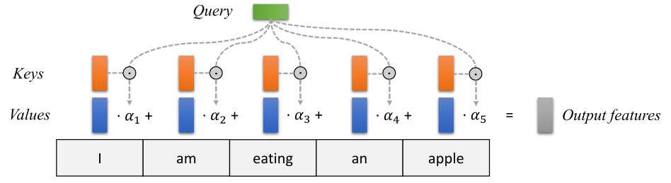

<v-clicks depth="2">

- Key vectors are generated using a weight matrix 
    - $$k_i = W_K \cdot h_i, \quad \text{for } i = 1 \text{ to } m$$
- Query $q_t$ is generated using another weight matrix
    -  $$q_t = W_Q \cdot s_t$$
</v-clicks>

<!--
Attentionメカニズムは、これらの課題を解決するために導入されました。その基本的な考え方は、人間が何かを理解する際に、文全体を漫然と読むのではなく、重要な部分に「注意を向ける」という認知プロセスを模倣することです。

具体的な仕組みは、主にクエリ（Query）、キー（Key）、バリュー（Value） の3つの概念を使って説明されます。

-->

---
transition: slide-up
level: 2
---

# The Principle of Transformer

Attention Mechanism

  

<v-clicks depth="2">

- The attention score $a_i^t$ between each key $k_i$ and the query $q_t$ is computed
    - $$a_i^t = k_i^T \cdot q_t$$
- $Softmax([a_1,...,a_m])$: Normalize with a softmax to create a vector of weights
</v-clicks>

<!--
デコーダが現在の単語を生成しようとするとき、現在の状態を表す「クエリ」と、入力シーケンス内の各単語を表す「キー」との類似度（関連度）を計算します。
この類似度は、通常、内積や加法などの関数を使って計算され、「アテンションスコア」と呼ばれます。スコアが高いほど、その単語の関連性が高いことを示します。

計算されたアテンションスコアは、Softmax関数を通して正規化され、合計が1になるような「アテンション重み（またはアテンション分布）」に変換されます。これにより、各単語がどれくらい重要であるかを示す確率的な重みが得られます。重みが大きいほど、その単語に強く「注目」していることを意味します。
-->

---
transition: slide-up
level: 2
---

# The Principle of Transformer

Attention Mechanism

  

<v-clicks depth="2">

- Create a fixed-length vector by taking a weighted sum of all the encoder hidden states
    - $$c_t=a_{1}^t h_1+...+a_{m}^t h_m$$

</v-clicks>

<!--
- 各単語に対応する「バリュー」（通常は単語の表現ベクトル自体）を、ステップ2で得られたアテンション重みで重み付けして合計します。
- これにより、現在のタスク（例：次の単語生成）にとって最も関連性の高い情報が強調された「文脈ベクトル」が生成されます。
-->

---
transition: slide-up
level: 2
---

# The Principle of Transformer

Self-Attention

<v-clicks depth="2">

- Create three vectors query, key, and value from each of the embeddings of each word
- $$W^Q, W^K, W^V \in R^{d_{model} \times d_k}$$

- Calculate attention scores between each word of the input sentence against a specific word

- $$Attention(\mathbf{Q},\mathbf{K},\mathbf{V})=softmax(\frac{\mathbf{Q}\mathbf{K}^T}{\sqrt{d_k}})V$$
</v-clicks>

  

---
transition: slide-up
level: 2
---

# The Principle of Transformer

Attention Mechanism

  

<v-clicks depth="2">

- Scale the attention scores, take the softmax, and then multiply the result by $V$ resulting in a matrix of shape $N \times d$: a vector embedding representation for each token in the input.

</v-clicks>

<!--
この新しい文脈ベクトルは、単一の固定ベクトルではなく、タスクや現在の出力の状況に応じて、入力シーケンスのどこに「注目」すべきかを動的に変化させながら生成される点が重要です。
-->

---
transition: slide-up
level: 2
---

# The Principle of Transformer

Attention Mechanism

  

<!--
この新しい文脈ベクトルは、単一の固定ベクトルではなく、タスクや現在の出力の状況に応じて、入力シーケンスのどこに「注目」すべきかを動的に変化させながら生成される点が重要です。
-->

---
transition: slide-up
level: 2
---

# The Principle of Transformer

Self-Attention

- 単一のシーケンス内で、各単語がそのシーケンス内の他のすべての単語とどのように関連しているかを評価し、それに基づいて単語の表現を学習する
   - 長距離依存関係を反映: 各単語はシーケンス内の他のすべての単語と直接関連度を計算するため、単語間の距離が離れていても、その関係性を効率的に学習
   - 並列計算: 各単語に対するSelf-Attentionの計算は、他の単語に対する計算とは独立して行える

<video controls width="700" style="display: block; margin-left: auto; margin-right: auto;">
  <source src="./image/encoder_self_attention.mp4" type="video/mp4">
</video>

<!--
Self-Attentionは、Attentionメカニズムの一般的な概念（クエリ、キー、バリュー）を、単一のシーケンス内の要素間で適用することで実現されます。

ある入力シーケンス $X = (x_1, x_2, \ldots, x_n)$ があるとき、各単語 $x_i$ について、以下の3つのベクトルが生成されます。

1.  **クエリ (Query: $Q$)**: 現在注目している単語が、他の単語に対して「何を探しているか」を表現します。
2.  **キー (Key: $K$)**: 他の単語が「どのような情報を持っているか」を表現します。
3.  **バリュー (Value: $V$)**: 他の単語が実際に提供する「情報そのもの」を表現します。

これらの $Q, K, V$ は、入力単語の埋め込みベクトル $x_i$ をそれぞれ異なる学習可能な重み行列 $W_Q, W_K, W_V$ で線形変換することで生成されます。

$Q_i = x_i W_Q$
$K_i = x_i W_K$
$V_i = x_i W_V$

Self-Attentionの計算は、主に以下のステップで行われます。

1.  **スコアの計算**:
    * 各単語のクエリ $Q_i$ と、シーケンス内の他のすべての単語のキー $K_j$ との内積（ドット積）を計算します。
    * この内積が、単語 $x_i$ が単語 $x_j$ にどれくらい「注目」すべきかの関連度スコアとなります。
    * スケールされたドット積（通常はキーベクトルの次元の平方根で割る）を使用することが一般的です。
    $Score(Q_i, K_j) = \frac{Q_i \cdot K_j}{\sqrt{d_k}}$ （$d_k$ はキーベクトルの次元）

2.  **重みの正規化**:
    * 計算されたすべてのスコアに対し、Softmax関数を適用します。これにより、各単語 $x_j$ への注目度を表す**アテンション重み**（合計が1になる確率分布）が得られます。
    $Attention\_Weight_{ij} = \text{Softmax}(Score(Q_i, K_j))$

3.  **重み付けされたバリューの合計**:
    * 各単語 $x_j$ に対応するバリュー $V_j$ を、計算されたアテンション重み $Attention\_Weight_{ij}$ で重み付けし、それらをすべて合計します。
    * これが、単語 $x_i$ の新しい表現（文脈を考慮した表現）である**出力ベクトル $Z_i$** となります。
    $Z_i = \sum_{j=1}^{n} Attention\_Weight_{ij} \cdot V_j$

このプロセスは、シーケンス内の各単語 $x_i$ ごとに行われます。結果として、各単語は、シーケンス内の他の単語すべてとの関係性を考慮した、より豊かな文脈的な表現を獲得します。
-->

---
transition: slide-up
level: 2
---

# The Principle of Transformer

Self-Attention

<v-clicks depth="2">

- Each attention score quantifies how relevant every other word (or token) in the sequence is to a given word.

- Self-attention processes all parts of the input can be parallelized. 
    - The input embedding of $N$ tokens can be packed into a single matrix:
    - $$X \in R^{N \times d}$$

</v-clicks>

  

---
transition: slide-up
level: 2
---

# The Principle of Transformer

Components in Transformer Architecture

<v-clicks depth="2">

- **Multi-Head Attention**: Allows the model to jointly attend to information from different representation subspaces (e.g., syntactic, semantic, and discourse relationships).

- **Positional Encoding**: Injects some information about the order of the sequence into the model.

- **Add & Norm Layer**: Encourages training deeper models by ensuring that backpropagation through many layers does not result in vanishing or exploding gradients.

</v-clicks>

  

---
transition: slide-up
level: 2
---

# LLMs with Transformer

  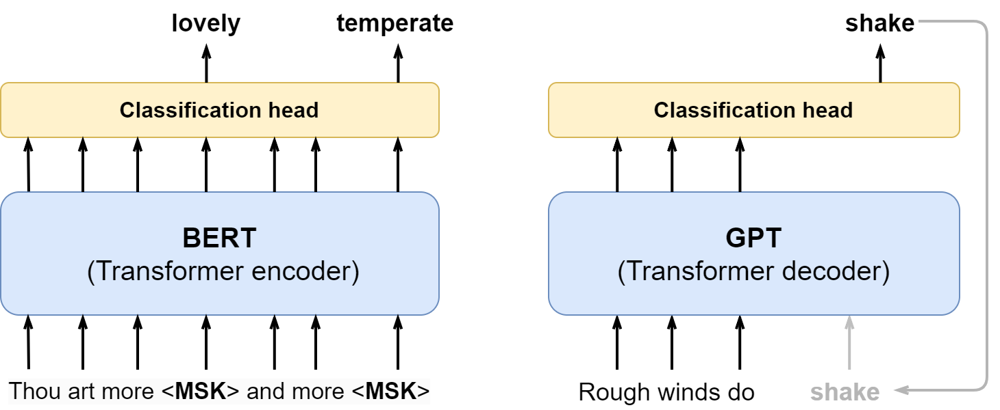

