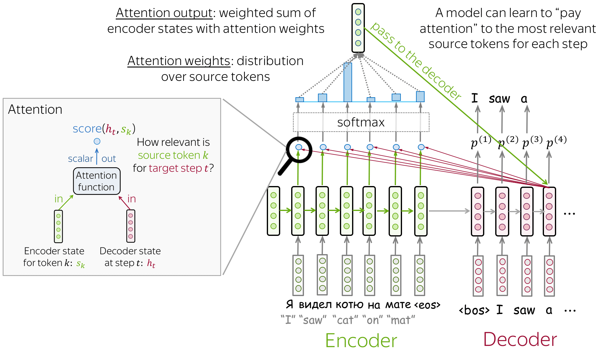
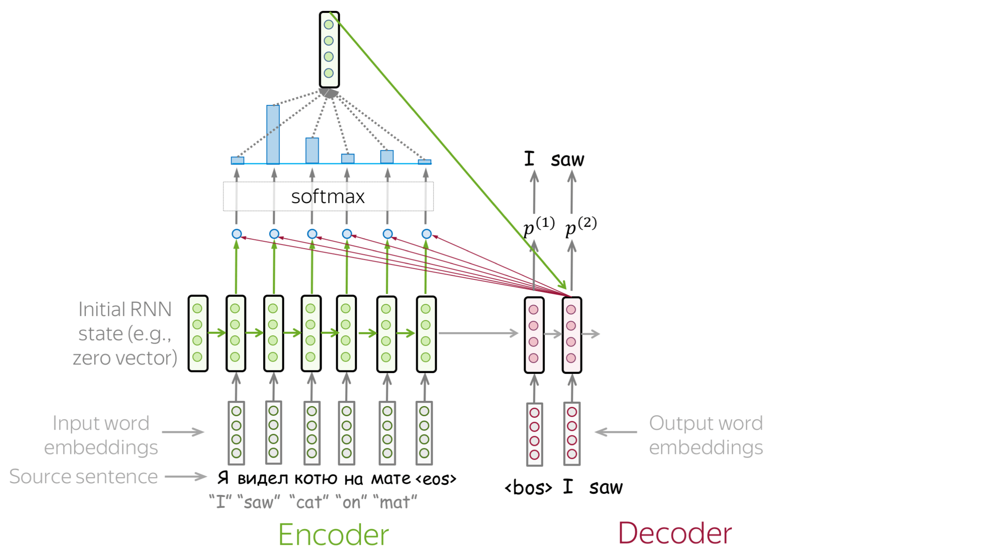

---
# You can also start simply with 'default'
theme: seriph
# random image from a curated Unsplash collection by Anthony
# like them? see https://unsplash.com/collections/94734566/slidev
background: https://cover.sli.dev
# some information about your slides (markdown enabled)
title: Welcome to Slidev
info: |
  ## Slidev Starter Template
  Presentation slides for developers.

  Learn more at [Sli.dev](https://sli.dev)
# apply unocss classes to the current slide
class: text-center
# https://sli.dev/features/drawing
drawings:
  persist: false
# slide transition: https://sli.dev/guide/animations.html#slide-transitions
transition: slide-left
# enable MDC Syntax: https://sli.dev/features/mdc
mdc: true
---

# Introduction to LLMs and Their Applications

ZEYU LYU

  Press Space for next page <carbon:arrow-right />

 
  <button @click="$slidev.nav.openInEditor" title="Open in Editor" class="slidev-icon-btn">
    <carbon:edit />
  </button>
  <a href="https://github.com/lvzeyu/Tohoku_AIE_PBL" target="_blank" class="slidev-icon-btn">
    <carbon:logo-github />
  </a>

<!--
The last comment block of each slide will be treated as slide notes. It will be visible and editable in Presenter Mode along with the slide. [Read more in the docs](https://sli.dev/guide/syntax.html#notes)
-->

---
transition: fade-out
---

# Overview of Lectures

LLMs Basics

<v-clicks depth="2">

- Lecture 1

    - 📝 High-level explanations of the fundamental concepts behind LLMs
    - 🎨 Insights into the transformer architecture
    - 🧑‍💻 Application of LLMs with Transformers library

- Lecture 2
    - Prompting and In-context Learning
    - Fine-tuning

- Lecture 3 
    - Advanced Applications of LLMs Agents

</v-clicks>

 

---
transition: slide-up
level: 2
---

# LLMs Basics

Journey of Language Models

  

---
transition: slide-up
level: 2
---

# LLMs Basics

What is LLMs?

<v-clicks depth="2">

- LLMs are deep neural networks trained on massive amounts of text data, designed to understand, generate, and respond to human-like text.
    - *"Large"* refers to both the model's size in terms of parameters and the dataset on which it's trained. 
    - LLMs are capable of *generating text*, LLMs are also often referred to as a form of generative AI.
    - LLMs utilize an architecture called the *Transformer*

</v-clicks>

---
transition: slide-up
level: 2
---

# LLMs Basics

What is GPT?

<v-clicks depth="2">

- G: **G**enerative model
- P: **P**re-trained
- T: **T**ransformer

</v-clicks>

---
transition: slide-up
level: 2
---

# LLMs Basics

Language Models(LMs)

- LMs estimate the probability of any sequence of word
    - **Setup**: Assume a vocabulary of words  
  $$
  V = \{W_1, W_2, W_3, \ldots, W_n\}
  $$

    - **Data**: Given a training set of example sentences

    - **Goal**: Estimate a probability distribution  
  $$
  \sum_{x \in V^{*}} p(x) = 1
  $$

---
transition: slide-up
level: 2
---

# LLMs Basics

Next-word Prediction Task

  

---
transition: slide-up
level: 2
---

# LLMs Basics

Text Generation

  

---
transition: slide-up
level: 2
---

# LLMs Basics

Transformer

<v-clicks depth="2">

- The Transformer has significantly advanced the field of NLP and is applied across a wide range of large language models.
- Self-attention mechanism allows the model to compute the relevance of each element in a sequence and use this information to understand the context. 
</v-clicks>

  

---
transition: slide-up
level: 2
---

# LLMs Basics

Seq2seq

<v-clicks depth="2">

- Seq2seq
    - Encoder: Process the input sequence and compress its information into a fixed-size representation called the context vector
    
    - Decoder: Use this encoded information (context vector) to generate the output sequence.

</v-clicks>

  

---
transition: slide-up
level: 2
---

# LLMs Basics

Seq2seq

<video controls width="700" style="display: block; margin-left: auto; margin-right: auto;">
  <source src="./image/seq2seq_training_with_target.mp4" type="video/mp4">
</video>

---
transition: slide-up
level: 2
---

# LMs before the Transformer

N-gram Language Model

**🚨 Basic Idea**: The probability of a word in a sequence depends on the previous words.  
$$
P(\text{bags}) = \frac{\text{count(students opened their bags)}}{\text{count(students opened their)}}
$$

**⚠️ Problem**: Computing probabilities of entire sequences is practically infeasible.

- Computational complexity  
- Data sparsity  
- Low generalization 

---
transition: slide-up
level: 2
---

# LMs before the Transformer

N-gram Language Model

- **🔁 Markov assumption**: The probability of a word depends only on the previous \( N-1 \) words.  
  $$
  P(w_n \mid w_{1:n-1}) = P(w_n \mid w_{n-N+1:n-1})
  $$

- For a sentence *students opened their __[blank]__*  
  $$
  P(w) = \frac{\text{count(opened their } w)}{\text{count(opened their)}}
  $$

<v-clicks depth="2">

- An N-gram is a contiguous sequence of $N$ items from a given text.
- N-gram language model refers to a probabilistic model that can estimate the probability of a word given the $n-1$ previous words.
</v-clicks>

  

---
transition: slide-up
level: 2
---

# LMs before the Transformer

Problems with N-gram Language Models

**⚠️ Storage Problem**: Increasing $n$ or increasing corpus increases model size.

**⚠️ Sparsity Problem**: Not much granularity in the probability distribution.

---
transition: slide-up
level: 2
---

# Language Model with RNNs

Recurrent Neural Networks (RNNs)

<v-clicks depth="2">

- Compute an output $y_t$ for an input $x_t$ requires activation value for the hidden layer $h_t$.
    - $h_t$ is calculated based on the input $x_t$ and the hidden layer from the previous time step $h_{t-1}$.
</v-clicks>

  

<v-clicks depth="2">

- Computation at time $t$ requires the value of the hidden layer from time $t − 1$ mandates an incremental inference algorithm that proceeds from the start of the sequence to the end. 
</v-clicks>

  

---
transition: slide-up
level: 2
---

# Language Model with RNNs

Recurrent Neural Networks (RNNs)

  

---
transition: slide-up
level: 2
---

# Language Model with RNNs

Recurrent Neural Networks (RNNs)

<v-clicks depth="2">

- Advantages of RNN LMs
    - Contextual Understanding: RNNs can capture longer dependencies in the text when making predictions.
    - Dynamic Computation: RNNs can handle input sequences of varying lengths without needing to predefine a fixed size.
- Disadvantages of RNN LMs: In a encoder-decoder model with RNNs LMs, the hidden state of the last time step represents absolutely everything about the meaning of the source text.
    - Sequential nature of RNNs means recurrent computation is slow.
    - Information at the beginning of the sentence, especially for long sentences, may not be equally well represented in the context vector.

</v-clicks>

  

---
transition: slide-up
level: 2
---

# The Principle of Transformer

Attention Mechanism

  

<v-clicks depth="2">

- Key vectors are generated using a weight matrix 
    - $$k_i = W_K \cdot h_i, \quad \text{for } i = 1 \text{ to } m$$
- Query $q_t$ is generated using another weight matrix
    -  $$q_t = W_Q \cdot s_t$$
</v-clicks>

---
transition: slide-up
level: 2
---

# The Principle of Transformer

Attention Mechanism

  

<v-clicks depth="2">

- The attention score $a_i^t$ between each key $k_i$ and the query $q_t$ is computed
    - $$a_i^t = k_i^T \cdot q_t$$
- $Softmax([a_1,...,a_m])$: Normalize with a softmax to create a vector of weights
</v-clicks>

---
transition: slide-up
level: 2
---

# The Principle of Transformer

Attention Mechanism

  

<v-clicks depth="2">

- Create a fixed-length vector by taking a weighted sum of all the encoder hidden states
    - $$c_t=a_{1}^t h_1+...+a_{m}^t h_m$$

</v-clicks>

---
transition: slide-up
level: 2
---

# The Principle of Transformer

Self-Attention

<v-clicks depth="2">

- Create three vectors query, key, and value from each of the embeddings of each word
- $$W^Q, W^K, W^V \in R^{d_{model} \times d_k}$$
</v-clicks>

  

---
transition: slide-up
level: 2
---

# The Principle of Transformer

Self-Attention

<v-clicks depth="2">

- Calculate attention scores between each word of the input sentence against a specific word

- $$Attention(\mathbf{Q},\mathbf{K},\mathbf{V})=softmax(\frac{\mathbf{Q}\mathbf{K}^T}{\sqrt{d_k}})V$$

</v-clicks>

  

---
transition: slide-up
level: 2
---

# The Principle of Transformer

Attention Mechanism

  

<v-clicks depth="2">

- Scale the attention scores, take the softmax, and then multiply the result by $V$ resulting in a matrix of shape $N \times d$: a vector embedding representation for each token in the input.

</v-clicks>

---
transition: slide-up
level: 2
---

# The Principle of Transformer

Attention Mechanism

  

---
transition: slide-up
level: 2
---

# The Principle of Transformer

Attention Mechanism

<v-switch>
      <template #1>
        
      </template>
      <template #2>
        
      </template>
      <template #3>
        
      </template>
      <template #4>
        
      </template>
      <template #5>
        
      </template>
      <template #6>
        
      </template>
      <template #7>
        
      </template>
      <template #8>
        
      </template>
    </v-switch>

---
transition: slide-up
level: 2
---

# The Principle of Transformer

Self-Attention

- 计算一个输入序列中每个元素对序列其他元素的Attention
   - 长距离依赖建模: 自注意力机制能够直接建模输入序列中任意两个位置之间的关系，从而有效捕捉长距离依赖
   - 并行化计算: 自注意力机制允许序列中所有元素同时处理，因此可以高效并行化计算，显著提高训练速度

<video controls width="700" style="display: block; margin-left: auto; margin-right: auto;">
  <source src="./image/encoder_self_attention.mp4" type="video/mp4">
</video>

---
transition: slide-up
level: 2
---

# The Principle of Transformer

Self-Attention

<v-clicks depth="2">

- Each attention score quantifies how relevant every other word (or token) in the sequence is to a given word.

- Self-attention processes all parts of the input can be parallelized. 
    - The input embedding of $N$ tokens can be packed into a single matrix:
    - $$X \in R^{N \times d}$$

</v-clicks>

  

---
transition: slide-up
level: 2
---

# The Principle of Transformer

Components in Transformer Architecture

<v-clicks depth="2">

- **Multi-Head Attention**: Allows the model to jointly attend to information from different representation subspaces (e.g., syntactic, semantic, and discourse relationships).

- **Positional Encoding**: Injects some information about the order of the sequence into the model.

- **Add & Norm Layer**: Encourages training deeper models by ensuring that backpropagation through many layers does not result in vanishing or exploding gradients.

</v-clicks>

  

---
transition: slide-up
level: 2
---

# LLMs with Transformer

  

