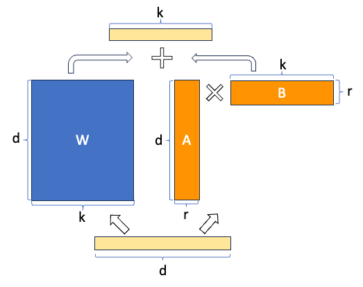

---
# You can also start simply with 'default'
theme: seriph
# random image from a curated Unsplash collection by Anthony
# like them? see https://unsplash.com/collections/94734566/slidev
background: https://cover.sli.dev
# some information about your slides (markdown enabled)
title: Welcome to Slidev
info: |
  ## Slidev Starter Template
  Presentation slides for developers.

  Learn more at [Sli.dev](https://sli.dev)
# apply unocss classes to the current slide
class: text-center
# https://sli.dev/features/drawing
drawings:
  persist: false
# slide transition: https://sli.dev/guide/animations.html#slide-transitions
transition: slide-left
# enable MDC Syntax: https://sli.dev/features/mdc
mdc: true

fonts:
  # basically the text
  sans: Robot
  # use with `font-serif` css class from UnoCSS
  serif: Robot Slab
  # for code blocks, inline code, etc.
  mono: Fira Code
---

# Post-training

Instruction of Finetuning, RLHF, and PEFT

ZEYU LYU

<div @click="$slidev.nav.next" class="mt-12 py-1" hover:bg="white op-10">
  Press Space for next page <carbon:arrow-right />
</div>

<div class="abs-br m-6 text-xl"> 
  <button @click="$slidev.nav.openInEditor" title="Open in Editor" class="slidev-icon-btn">
    <carbon:edit />
  </button>
  <a href="https://github.com/lvzeyu/Tohoku_AIE_PBL" target="_blank" class="slidev-icon-btn">
    <carbon:logo-github />
  </a>
</div>

<!--
The last comment block of each slide will be treated as slide notes. It will be visible and editable in Presenter Mode along with the slide. [Read more in the docs](https://sli.dev/guide/syntax.html#notes)
-->

---
transition: fade-out
---

# The traditional way: Fine-tuning for domain-specific task

<div grid="~ cols-2 gap-4 items-start">

<div>

<v-clicks depth="2">

- Fine-tuning refers to the process of adapting a pre-trained language model to a specific downstream task or domain by continuing training on a smaller and task-specific dataset.

    - **Pros**: Strong performance on many benchmarks
    
    - **Cons**: Need a new large dataset for each task

    - **Cons**: Potential for poor out-of distribution generalization

</v-clicks>

</div>

<div class="flex justify-center">
  
</div>

</div>

 

---
transition: fade-out
---

# In-context learning (ICL) 

<div grid="~ cols-2 gap-4 items-start">

<div>

<v-clicks depth="2">

- No training or optimization of the model parameters in the “adaptation step”.
- Simply give the model a task description as well as none/one/few examples as the input at inference time.
    -  The model's internal weights and parameters are not changed during ICL

</v-clicks> 

</div>

<div class="flex justify-center">
  
</div>

</div>


---
transition: fade-out
---

# In-context learning (ICL) 

<div class="flex justify-center">
  
</div>


---
transition: fade-out
---

# NLP tasks casted as word prediction

<div class="flex justify-center">
  
</div>


---
transition: fade-out
---

# Emergent Abilities

<div class="flex justify-center">
  
</div>


---
transition: fade-out
---

# Limits of prompting for harder tasks?


<v-clicks depth="2">

- Some tasks seem too hard for even large LMs to learn through prompting alone (e.g., mathematical proofs, logic puzzles).

</v-clicks>


<div grid="~ cols-2 gap-4 items-start">

<div class="flex justify-center">
  
</div>

<div class="flex justify-center">
  
</div>

</div>

<!--
人間が「strawberry」の「r」を数える場合、私たちは文字として認識し、一つずつ数えるというプロセスを踏みます。LLMは、このような文字レベルでの操作や厳密な数え上げの「理解」を持っているわけではありません。彼らは、膨大なデータの中で単語がどのように使われ、どのような文脈で出現するかという「統計的なパターン」を学習しています。

「意味」は捉えるが「構造」は捉えにくい: しかし、単語埋め込みは、単語やトークンが持つ「意味」や「文脈」を捉えることを主眼としており、その単語やトークンを構成する「文字」の厳密な並びや数といった「構造的」な情報を直接的にエンコードするようには設計されていません。
つまり、埋め込みベクトルは「strawberry」が果物であり、甘くて赤い、といった意味的な情報を効率的に圧縮しますが、「r」が3つ含まれているという文字レベルの構造的な情報は、その埋め込みベクトルから容易に読み取ることはできません。
-->


---
transition: fade-out
---

# Chain-of-thought prompting

<div class="flex justify-center">
  
</div>


---
transition: fade-out
---

# Chain-of-thought prompting

COT is an emergent property of model scale


<div class="flex justify-center">
  
</div>


---
transition: fade-out
---

# Chain-of-thought prompting

Zero-shot COT Prompting


<div class="flex justify-center">
  
</div>


---
transition: fade-out
---

# Chain-of-thought prompting

Zero-shot COT Prompting


<div class="flex justify-center">
  
</div>


---
transition: fade-out
---

# Instruction finetunin


- While pre-training LLMs on vast amounts of data allows them to learn about the world, they often struggle to respond to specific prompts or instructions.


<div grid="~ cols-2 gap-4 items-start">

<v-clicks depth="2">

- **Instruction fine-tuning** augments input-output examples with instructions, which enables instruction-tuned models to generalize more easily to new tasks.
    - Collect examples of (instruction, output) pairs across many tasks and finetune an LM

</v-clicks> 

<div class="flex justify-center">
  
</div>

</div>


---
transition: fade-out
---

# Instruction finetunin


<div class="flex justify-center">
  
</div>


<div class="flex justify-center">
  
</div>

<!--
このデータセットは、**「指示（instruction）」と、その指示に対する「望ましい応答（response）」**のペアで構成されます。
指示は多岐にわたります。例えば、
- 質問応答: 「日本の首都はどこですか？」→「東京です。」
- 要約: 「[長い記事]を要約してください。」→「[短い要約]」
- 翻訳: 「Hello, world! を日本語に翻訳してください。」→「こんにちは、世界！」
- アイデア出し: 「新しいスマートフォンアプリのアイデアを3つ提案してください。」→「[アイデア1, 2, 3]」
- 文章作成: 「感動的な詩を書いてください。」→「[詩]」

このデータは、手動での作成、既存のデータセットの変換、または人間のアノテーターによるラベル付けを通じて準備されます。

Instruction Fine-tuningが完了すると、モデルは「Instruct model (指示モデル)」となります。このInstruct modelは、事前学習されたベースモデルと比較して、以下のような改善が見られます。

- 指示の理解度向上: ユーザーの意図をより正確に把握し、複雑なプロンプトにも対応できるようになります。
- 応答の適切性向上: 指示された内容に沿った、関連性のある、質の高い応答を生成します。
- 「会話」能力の向上: ユーザーとの対話の中で、自然に指示に従い、一貫性のある応答を返す能力が高まります。
-->

---
transition: fade-out
---

# Instruction finetunin


- Finetuning LM with some CoT data included in the mixture enables zero-shot CoT reasoning in unseen tasks.

<div class="flex justify-center">
  
</div>


---
transition: fade-out
---

# Optimizing for human preferences

Limitations

- Mismatch between LM objective and human preferences
    - The LM's objective is Next-Token Prediction.
    - Human preferences are more nuanced and context-dependent. 
        - They involve factors like relevance, coherence, politeness, ethical considerations, and the overall helpfulness of the response.
    - Even with instruction finetuning, there a mismatch between the LM objective and the objective of “satisfy human preferences”.
        - LM's objective doesn't inherently teach the model to be truthful, helpful, harmless, unbiased, or to truly understand and fulfill a user's intentions. 


---
transition: fade-out
---

# Optimizing for human preferences

RLHF

Reinforcement Learning from Human Feedback (RLHF) is a technique that combines reinforcement learning with human feedback to optimize a language model.


<div class="flex justify-center">
  
</div>


---
transition: fade-out
---

# Optimizing for human preferences

RLHF

<div grid="~ cols-2 gap-4 items-start">

<div class="flex justify-center">
  
</div>

<div class="flex justify-center">
  
</div>

</div>


---
transition: fade-out
---

# Post-training

<div class="flex justify-center">
  
</div>


<!--
- Instruction Alignment: ベースモデルがユーザーの指示に従って応答を生成できるようにすること。
    - SFTプロセスには、「Instruction-following labeled data (指示追従のラベル付きデータ)」が大量に用いられます。このデータは、特定の指示とそれに対応する望ましい応答のペアで構成されています。
- Preference Alignment (選好の整合)
    - このRLHFには、「Preference data (選好データ)」が用いられます。図中では $(x^{(i)}, Y_w^{(i)}, Y_l^{(i)})$ と示されており、これはおそらく、入力 $x^{(i)}$ に対して生成された複数の応答の中から、人間がより良いと判断した応答 $Y_w^{(i)}$ と、より悪いと判断した応答 $Y_l^{(i)}$ のペアを意味します。LHFを通じて、モデルは人間の評価基準を学習し、より質の高い、人間の選好に沿った応答を生成できるようになります。
    - このステップを経て、「Aligned model (整合されたモデル)」が最終的に得られます。この整合されたモデルは、InstructGPTやChatGPTのような高性能な大規模言語モデルの基盤となります。
-->


---
transition: fade-out
---

# Parameter efficient fine-tuning (PEFT)

From fine-tuning to PEFT


- Performing full-finetuning of LLMs is computationally intensive and time-consuming.
    - PEFT: Update a small subset of model parameters
<div class="flex justify-center">
  
</div>


---
transition: fade-out
---

# Parameter efficient fine-tuning (PEFT)

PEFT Method

<div class="flex justify-center">
  
</div>


---
transition: fade-out
---

# Parameter efficient fine-tuning (PEFT)

Low-rank-parameterized update matrices(LoRA)

<div class="flex justify-center">
  
</div>


---
transition: fade-out
---

# Parameter efficient fine-tuning (PEFT)

Low-rank-parameterized update matrices(LoRA)

<div grid="~ cols-2 gap-4 items-start">

<v-clicks depth="2">

- Freeze most of the original LLM weights.

- Inject 2 rank decomposition matircs

- Train the weights of the smaller matrics

- Update the model for inference
    - Matrix multiply the low rank matrics
    - Add the LoRA weights to the original weights
</v-clicks> 

<div class="flex justify-center">
  
</div>

</div>


<p v-click style="color: rgb(199, 26, 26); font-size: 1.5em; text-align: center;">
  LoRA is often applied to the weight matrices in the self-attention module
</p>


---
transition: fade-out
---

# Parameter efficient fine-tuning (PEFT)

Concrete example using base Transformer as reference

<v-clicks depth="2">

- Using the base Transformer model

    - Transformer weights have dimensions $d \times k = 512 \times 64$.
    - Thus $512 \times 64 = 32768$ trainable parameters

- In LoRA with $r=8$
    - $A$ has dimensions $r \times k = 8 \times 64 = 512$ parameters
    - $B$ has dimensions $d \times r = 512 \times 8 = 4096$ parameters
</v-clicks> 


<p v-click style="color:rgb(199, 26, 26); font-size: 2em; text-align: center;">
  86% reduction in parameters to train
</p>


---
transition: fade-out
---

# Parameter efficient fine-tuning (PEFT)

The Performance of LoRA

- LoRA matches or exceeds the fine-tuning baseline on all three datasets.
<div class="flex justify-center">
  
</div>

---
transition: fade-out
---

# Quantized Language Models

Quantization

<div grid="~ cols-2 gap-4 items-start">

<v-clicks depth="2">

- As the scale of language models increases, the number of parameters and computational complexity grow significantly.
- Quantization is a technique that converts model weights from high precision to lower precision
    - Improves efficiency with only a slight drop in performance
    - Reduces computational resource requirements and speeds up inference
</v-clicks> 

<div class="flex justify-center">
  
</div>

</div>

---
transition: fade-out
---

# Quantized Language Models

QLoRA

<v-clicks depth="2">

- The combination of PEFT and quantized language models enables resource-efficient fine-tuning of large language models: QLoRA (Quantized Low-Rank Adapter)
    - [peft](https://github.com/huggingface/peft): Adds PEFT layers directly to models loaded with ```transformers```
    - [bitsandbytes](https://github.com/bitsandbytes-foundation/bitsandbytes): Supports quantization and efficient matrix operations
    - [Transformers](https://github.com/huggingface/transformers):Supports loading quantized models and building LLMs for fine-tuning

</v-clicks> 


````md magic-move {lines: true}


```ts {*|6|*}
# Define Quantization Configuration
from transformers import BitsAndBytesConfig
bnb_config = BitsAndBytesConfig(
    load_in_4bit=True,
    bnb_4bit_use_double_quant=True,
    bnb_4bit_quant_type="nf4"
)
```

```ts {*|5|*}
#Load the Quantized Model
from transformers import AutoModelForCausalLM
model = AutoModelForCausalLM.from_pretrained(
    "meta-llama/Llama-2-7b-hf",
    quantization_config=bnb_config,
    device_map="auto"
)
```

```ts {*|4|*}
#Define PEFT Configuration (LoRA)
from peft import get_peft_model, LoraConfig, TaskType
lora_config = LoraConfig(
    r=8,
    lora_alpha=16,
    lora_dropout=0.05,
    target_modules=["q_proj", "v_proj"],
    bias="none",
    task_type=TaskType.CAUSAL_LM
)

model = get_peft_model(base_model, lora_config)
```

```ts
#Insert LoRA Adapters
model = get_peft_model(model, lora_config)

```

````
 


---
transition: fade-out
---

# Summary

- The scability of LLMs enable the in-context learning that handle tasks simply by providing examples within the prompt.
    - The quality, clarity, and structure of that prompt directly affect the model's ability to "learn" and perform the desired task.
    - Chain-of-Thought (CoT) Prompting is particulary useful in complex reasoning tasks
- Post-training techniques play a crucial role in enhancing its capabilities, alignment, and task generalization of LLMs
    - SFT: Adapt to specific tasks/domains
        - Instruction Fine-Tuning: Improve ability to follow natural language instructions and generalize.
    - RLHF: Align with human preferences
- QLoRA is widely applied method for fine-tuning LLMs.

