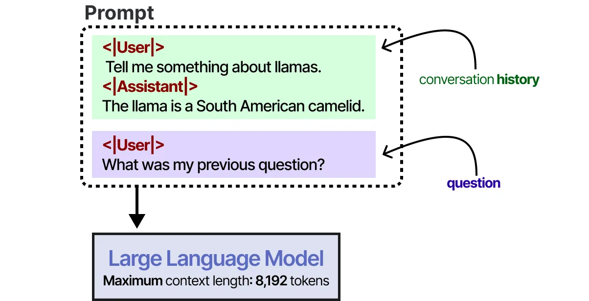
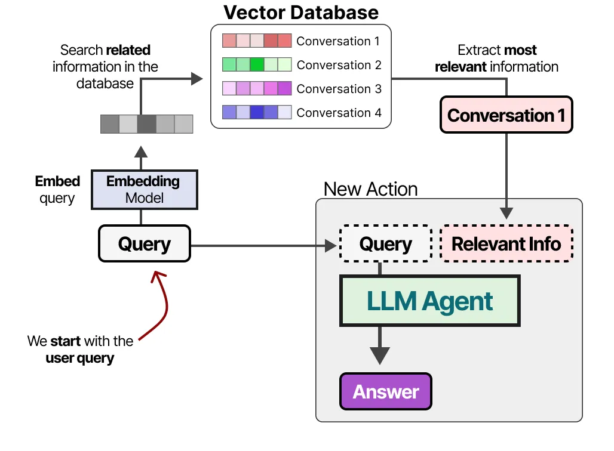

---
# You can also start simply with 'default'
theme: seriph
# random image from a curated Unsplash collection by Anthony
# like them? see https://unsplash.com/collections/94734566/slidev
background: https://cover.sli.dev
# some information about your slides (markdown enabled)
title: Welcome to Slidev
info: |
  ## Slidev Starter Template
  Presentation slides for developers.

  Learn more at [Sli.dev](https://sli.dev)
# apply unocss classes to the current slide
class: text-center
# https://sli.dev/features/drawing
drawings:
  persist: false
# slide transition: https://sli.dev/guide/animations.html#slide-transitions
transition: slide-left
# enable MDC Syntax: https://sli.dev/features/mdc
mdc: true

fonts:
  # basically the text
  sans: Robot
  # use with `font-serif` css class from UnoCSS
  serif: Robot Slab
  # for code blocks, inline code, etc.
  mono: Fira Code
---

# Advanced Application of LLMs

RAG and LLM-based Agent

ZEYU LYU

<div @click="$slidev.nav.next" class="mt-12 py-1" hover:bg="white op-10">
  Press Space for next page <carbon:arrow-right />
</div>

<div class="abs-br m-6 text-xl"> 
  <button @click="$slidev.nav.openInEditor" title="Open in Editor" class="slidev-icon-btn">
    <carbon:edit />
  </button>
  <a href="https://github.com/lvzeyu/Tohoku_AIE_PBL" target="_blank" class="slidev-icon-btn">
    <carbon:logo-github />
  </a>
</div>

<!--
The last comment block of each slide will be treated as slide notes. It will be visible and editable in Presenter Mode along with the slide. [Read more in the docs](https://sli.dev/guide/syntax.html#notes)
-->

---
transition: fade-out
---

# LLMs have difficulty


<v-clicks depth="2">

- ⚠️ **Out of date**
  - **Prompt**: Who is the Prime Minister of the UK?
  - **Completion**: Boris Johnson


- 💭 **Hallucination**
  - **Prompt**: Tell me about the book *The Lost City of Atlantis* by John Doe.
  - **Completion**: The book *The Lost City of Atlantis* by John Doe explores the mythical city in great detail  
    - ❌ _No such book or author exists._
</v-clicks>


---
transition: fade-out
---

# Retrieval Augmented Generation(RAG)

The Basis of RAG

<div grid="~ cols-2 gap-4 items-start">

<v-clicks depth="2">

- **Limitations and inefficient knowledge encoding of LLMs training**
    -  LLMs needs to be exposed to the same knowledge point up to 1000 times in the pre-training data for accurate memorization [(Allen-Zhu and Li, 2024)](https://arxiv.org/abs/2404.05405)
    - GPT-4 Turbo achieved only 73.6% in a knowledge memorization test for undergraduate knowledge[(Zhang et al., 2023)](https://arxiv.org/abs/2312.07398)
</v-clicks> 

<div class="flex justify-center">
  
</div>

</div>

<p v-click style="color:rgb(199, 26, 26); font-size: 1em; text-align: center;">
  <strong class="text-lg">Retrieval-Augmented Generation (RAG)</strong> for addressing the limitations of LLMs in terms of knowledge coverage, real-time information, and accuracy
</p>

<!--
大規模なパラメータ数と膨大な学習データを誇るLLMであっても、ある特定の事実や知識（例：「アメリカ合衆国の首都はワシントンD.C.である」といった事実）を正確かつ確実に記憶するためには、その知識に何百回、場合によっては最大で1000回もトレーニングデータ内で「露出」する必要があるとされています。
LLMが多様な知識を習得するためには、トレーニングデータが非常に大規模であるだけでなく、重要な知識点が大量に重複して含まれている必要があることを示唆しています。
一つの知識点を記憶するためにこれほど多くの露出が必要となると、モデルのトレーニングにかかる計算資源（計算能力や時間）が非常に大きくなることを意味します。

RAG（Retrieval-Augmented Generation）**は、2020年に初めて論文で提案されて以来、大きな注目を集めている技術です

RAGは、大規模言語モデルに外部の知識ベースやリアルタイム検索機能を組み合わせて使います。

たとえば、ユーザーが次のような質問をしたとします：

「東北大学はどこにありますか？」

通常の言語モデルでは、事前学習されたパラメータ内の知識に頼って答えを出します。しかし、RAGを用いると：

東北大学の公式サイトや百科事典などの情報源を検索

検索で得られたテキストを、ユーザーの質問とともに大規模言語モデルに渡す

モデルは、それらの資料を「読んだうえで」、回答を生成

つまり、RAGはモデルを**「閉じた本で解く試験（Closed-book QA）」から「資料を見ながら解く試験（Open-book QA）」**へと変える仕組みです。
-->


---
layout: center
clicks: 5 # Total number of click steps to reveal all content
---

# Retrieval Augmented Generation(RAG)


<div class="relative">
  

  <div v-click="[1, 2]" class="absolute bg-white p-4 rounded-lg shadow-lg" style="width: 60%; top: 70%; left: 60%; transform: translate(-50%, -50%);">
    <p class="text-center">
      <strong class="text-lg">Input</strong>: The question to which the LLM system responds is referred to as the input. If no RAG is used, the LLM is directly used to respond to the question.
    </p>
  </div>

  <div v-click="[2, 3]" class="absolute bg-white p-4 rounded-lg shadow-lg" style="width: 60%; top: 60%; left: 60%; transform: translate(-50%, -50%);">
    <p class="text-center">
      <strong class="text-lg">Indexing</strong>: If RAG is used, then a series of related documents are indexed by chunking them first, generating embeddings of the chunks, and indexing them into a vector store. At inference, the query is also embedded in a similar way.
    </p>
  </div>

  <div v-click="[3, 4]" class="absolute bg-white p-4 rounded-lg shadow-lg" style="width: 60%; top: 60%; left: 35%; transform: translate(-50%, -50%);">
    <p class="text-center">
      <strong class="text-lg">Retrieval</strong>: The relevant documents are obtained by comparing the query against the indexed vectors, also denoted as "Relevant Documents".
    </p>
  </div>

  <div v-click="[4, 5]" class="absolute bg-white p-4 rounded-lg shadow-lg" style="width: 80%; top: 20%; left: 50%; transform: translate(-50%, -50%);">
    <p class="text-center">
      <strong class="text-lg">Generation</strong>: The relevant documents are combined with the original prompt as additional context. The combined text and prompt are then passed to the model for response generation which is then prepared as the final output of the system to the user.
    </p>
  </div>
</div>

<!--
- Input（入力）
    - ユーザーが大規模言語モデル（LLM）に対して質問を投げかけます。
    - RAGを使用しない場合、この質問はそのままLLMに渡され、事前学習された知識に基づいて回答が生成されます。
- Indexing（インデックス作成）
    - RAGを使用する場合、まず関連する外部文書（たとえばWikipediaや自社のマニュアルなど）を準備します。これらの文書はまず「チャンク（小さな断片）」に分割されます
    - 各チャンクは**埋め込みベクトル（意味的な特徴を持つ数値表現）**に変換され、ベクトルデータベースに登録（インデックス化）されます
    - ユーザーの質問も埋め込みベクトルに変換されます。
- Retrieval
    - RAGにおける検索（Retrieval）は、ユーザーの質問（クエリ）に対して関連する外部文書を見つけ出すためのステップです。
    - クエリのベクトルと、それら文書ベクトルとの間で**コサイン類似度（cosine similarity）**などの指標を使って、意味的に近いかどうかを測定します
    - 類似度の高い順に文書を並べ替えます

- Generation（生成）
    - 検索された関連文書は、元のユーザーの質問と一緒に**大規模言語モデルへの入力（プロンプト）**として結合されます
    - モデルはこの情報をもとに、文脈に即した回答を生成します
    - 最終的に、生成されたテキストがユーザーへの**応答（Output）**として提供されます
-->


---
transition: fade-out
---

# Retrieval Augmented Generation(RAG)

The workflow of RAG

<div class="flex justify-center">
  
</div>


---
transition: fade-out
---

# Retrieval Augmented Generation(RAG)

RAG Task Categorization

<div class="flex justify-center">
  
</div>

<!--
- Explicit Facts Query (明示的な事実クエリ)
    - 説明: Explicit Facts Query は、データセットや情報源に直接的に、かつ明確に記述されている情報を求めるクエリです。推論や解釈を必要とせず、表面的な情報を抽出することが目的です。
    - 特徴:
        - 情報が明示的に記載されている。通常、キーワード検索やシンプルなデータベースクエリで対応可能。曖昧さが少なく、回答は客観的
    - 例:「2024年の日本のGDPはいくらですか？」「この製品の価格は何円ですか？」
- Implicit Facts Query (暗黙的な事実クエリ): データセットや情報源に直接は記述されていないが、複数の明示的な事実から推論できる情報を求めるクエリです。情報を統合し、関連性を見出すことで導き出される事実を指します。ある程度の解釈や推論能力が必要です。
    - 「この地域の平均気温は過去5年間でどのように変化しましたか？」（年ごとの気温データから計算・推移を把握）
    - 「A市とB市ではどちらがより人口密度が高いですか？」（それぞれの市の人口と面積データから計算・比較）

- Interpretable Rationales Query (解釈可能な根拠クエリ): ある結論や決定、あるいは提示された情報がなぜそうであるのか、その理由や根拠を求めるクエリです。その根拠は、人間が理解し、納得できるように説明できる必要があります。特にAIや機械学習の文脈では、モデルが特定の出力をした理由を人間が理解できるように示すことが重要になります。
    - 「「この診断結果が出た根拠を説明してください。」→診断ガイドラインや過去の類似症例の分析結果などの根拠を検索し、LLMに渡して説明させる。
- Hidden Rationales Query (隠れた根拠クエリ):結論や決定の根拠が直接的または容易にアクセスできない、あるいは人間には理解しにくい形である場合に、その根拠を探索するクエリです。特に複雑なシステムやブラックボックスモデルにおいて、その内部動作や意思決定プロセスを深掘りする際に用いられます。多くの場合、直接的な説明ではなく、間接的な分析やシミュレーションを通じて理解を試みます。
　　　- 24-point Game (24点ゲーム):Numbers: 1, 2, 3, 3, 7, 7 (与えられた数字)
     - Solution: (7 + 7) / (3 - 1) + 3 + 2 (これらの数字を使って24を作るための計算式)
     - これは、与えられた数字から隠された計算ルールや組み合わせを見つけ出し、特定の目標（24という結果）を達成する例として示されています。これは、直接的な事実の検索ではなく、数字間の関係性や演算子の適用順序といった「隠れた根拠」を推論する能力を必要とします。
- 「現在の国際経済情勢は、この会社の将来の発展にどのように影響しますか？」 財務報告書と経済・財務推論を組み合わせて分析する必要があります。

- 隠れた推論の難しさ（難点）:

主な難点は以下の2つの側面に現れます。

- 論理的検索 :
    - 隠れた推論の問題は、エンティティレベルやセマンティックな類似性だけでなく、論理的一貫性や主題の整合性に焦点を当てる必要があることが多いです。しかし、既存の検索方法は、クエリの真の目標を正確に捉えたり、論理的に類似したテキストフラグメントを識別することが困難です。表面的なテキストの類似性にのみ依存するのではなく、潜在的な論理構造を解析・識別できる、より高度な検索アルゴリズムの開発が求められます。
- データ不足 :
    - 隠れた推論に必要な情報は、間接的に提示され、複数のデータソースに分散しており、明確な指針が欠如しています。外部データは直接的な関連回答を含んでおらず、例示や分散した知識を通じて間接的に現れることがあります。これにより、データの解釈と統合能力が非常に高く求められます。モデルは断片的な、または間接的に関連するデータから一貫した回答を推論する必要があります。
-->

---
transition: fade-out
---

# Retrieval Augmented Generation(RAG)

Modular RAG

<div class="flex justify-center">
  
</div>


<!--
例えば、Indexを考えてみます。
RAGシステムにおいて「索引（Index）」は文書を「管理可能なチャンク（断片）」に分割することです。これにより、後続の検索（Retrieval）と生成（Generation）のために、整理されたコンテンツの基盤が提供されます。

チャンクを構築する際には、コンテンツの意味的特性（语义特性）: チャンクが意味的なまとまりを持つとと、文脈の完全性（上下文完整性）: チャンクが独立しても意味が通じるように、関連する文脈情報を含める。

大きいチャンクの場合、より多くの文脈情報を捕捉できるが、無関係な情報が混入しやすくなり、検索システムの精度が低下する可能性があります。処理時間と計算コストが増加します

小さいチャンクの場合、より洗練され、ノイズが少ない、ユーザーのクエリに対してより的を絞った応答できるが、文脈情報の不足可能性があります

- ブロック最適化：チャンクを完全に独立させるのではなく、チャンク間に一部の重複を持たせることで、文脈の連続性を保ちます。あるチャンクの末尾と次のチャンクの先頭で情報が途切れるのを防ぎ、重要な情報がチャンクの境界で分断されるリスクを低減します。特に、意味的に連続する情報が複数のチャンクにまたがる場合に有効です
- 構造最適化: 単に文書を平坦にチャンクに分割するだけでなく、文書全体の論理的な階層（例：セクション、サブセクション、パラグラフなど）を考慮に入れたチャンクのグループ化や組織化・検索時に効率的に必要な情報をたどり着けるようにします。これにより、大規模な文書から特定の情報を探す際の効率が大幅に向上します。
-->


---
transition: fade-out
---

# Retrieval Augmented Generation(RAG)

RAG Evaluation

<div class="flex justify-center">
  
</div>

- Consider not only the relevance of the search results but also to evaluate them from various perspectives such as their accuracy and reliability.

---
transition: fade-out
---

# Retrieval Augmented Generation(RAG)

Applications of RAG

<div grid="~ cols-2 gap-4 items-start">

  <div class="flex flex-col items-center">
    
    <p class="mt-2 text-sm text-gray-600 text-center">SearchGPT retrieves up-to-date information from the internet in real time based on the user's query, achieving more accurate and reliable information delivery.</p>
  </div>

  <div class="flex flex-col items-center">
    
    <p class="mt-2 text-sm text-gray-600 text-center">NotebookLM retrieves documents uploaded by the user (such as PDFs or web pages), and based on this content, the Gemini model performs tasks such as answering questions, summarization, or audio generation.</p>
  </div>

</div>


<!--
SerachGPT:AI生成による 自然言語の回答＋出典リンク を提供し、会話的に検索しやすくするための機能です 。
- 質問→回答→続けて関連する質問、というフローで文脈を保持しながら検索可能 
- Bing等の最新ウェブ情報を参照。ニュース、株価、天気、スポーツ情報などに対応 
- 回答内に出典リンクを明示し、それらの信頼性確認が容易 。
-->


---
transition: fade-out
---

# LLMs-based Agent

What is AI Agent?

<div grid="~ cols-2 gap-4 items-start">

<v-clicks depth="2">

- Agent is a system designed to autonomously perceive its environment, reason, plan, act to achieve specific goals, and learn/adapt from the outcomes of its actions.

- LLM-based agent can understand and generate natural language, reason, access external tools or data, and interact autonomously to achieve complex goals.
</v-clicks> 

<div class="flex justify-center">
  
</div>

</div>

<!--
エージェントとは、環境内で自律的に行動し、自身の目的を達成しようとする実体。AI研究の初期段階から、エージェントの概念は存在していました。現在の知覚のみに基づいて行動を決定します。過去の経験や状態を記憶せず、単純な「もし〜ならば、〜せよ」というルールに基づいて反応します。
- サーモスタット: 設定温度より室温が高ければ冷房を入れ、低ければ暖房を入れる。
現在の知覚に加えて、環境の「モデル」を内部に持ちます。このモデルは、環境がどのように変化するか、そして自身が行動したときに環境がどうなるかを予測するために使用されます。これにより、部分的にしか観測できない環境でも、より適切な行動を選択できます。
- チェスプログラム: 現在の盤面だけでなく、次の手の結果を予測し、相手の可能な手を考慮して最善の一手を選択する。

LLMベースエージェントは、明示的なルールやモデルに縛られず、自然言語による指示を解釈し、複雑な状況を理解し、多段階の思考プロセスを経て計画を立てることができます。
汎用性: 特定のタスクに特化していた早期のエージェントに対し、LLMベースエージェントは、様々なドメインやタスクに適用できる汎用性を持っています。
LLMの能力を外部ツールと組み合わせることで、自身の知識や能力の限界を超えて、現実世界と相互作用する能力が飛躍的に向上しました。
早期のエージェントも学習機能を持つものはありましたが、LLMベースエージェントは、より大規模なデータから学習し、対話を通じて継続的に適応・改善していく能力を持っています。
-->


---
transition: fade-out
---

# LLMs-based Agent

Example of LLM-based Agent

<div style="display: flex; justify-content: center; align-items: center; flex-direction: column;">
<v-switch>
      <template #1>
        
      </template>
      <template #2>
        
      </template>
      <template #3>
        
      </template>
      <template #4>
        
      </template>
      <template #5>
        
      </template>
</v-switch> 
</div>

---
transition: fade-out
---

# LLMs-based Agent

Framework of LLMs-based Agent


<div grid="~ cols-2 gap-4">
<div>


- 🔍 Perception: The agent receives information from the environment

- 🧠 Think: Based on observed environmental states and task inputs, the agent models the task's intention, plans strategies, and makes decisions through reasoning.

- ⚙️ Act: LLM Agent can perform actions such as enerating responses and calling external tools

- 🧾 Memory: LLM Agent can store, organize, and retrieve past interaction records, knowledge fragments, or environmental states.

</div>

<div>

<div style="display: flex; justify-content: center;">
  
</div>
</div>
</div>

<!--
- 1. Perception
    - エージェントが環境から情報を受け取る能力です。これには、以下のようなものが含まれます。
    - 外部環境からのデータ: ウェブページの内容、データベースからの情報、センサーデータなど、外部の世界から得られるあらゆる種類の情報。
    - エージェントは、この「観察」を通じて現在の状況や必要な情報を把握します。

- 2. 思考（Think）
    - 観察された環境の状態や与えられたタスク入力に基づいて、エージェントがタスクの意図をモデル化し、戦略を計画し、推論に基づいて意思決定を行うプロセスです。
    - LLMの強力な言語理解と生成能力がここで中心的な役割を果たします。具体的には、以下のような思考を行います。
    - 問題の理解: ユーザーの意図やタスクの目的を深く理解する。
    - タスクの分解: 複雑なタスクを、より実行可能な小さなステップに分割する。
    - 計画の立案: 各ステップを実行するための順序や方法を決定する。
    - 推論と意思決定: 観察された情報と自身の知識に基づいて、次に取るべき最適な行動を決定する。
- 3. 行動（Act
    -「思考」のプロセスで導き出された推論結果を実行したり、タスクを完了するために**「ツール」を呼び出して利用する**能力です。
    - LLMエージェントは、以下のような行動をとることができます。
    - 情報生成: テキストの生成、要約、翻訳など。
    - 外部ツールの利用:
- 4. 記憶（Memory）
    - エージェントが過去の対話記録、知識の断片、または環境の状態を保存し、整理し、必要に応じて取り出す能力です。
-->

---
transition: fade-out
---

# LLMs-based Agent

Framework of LLMs-based Agent

 <div class="flex flex-col items-center">
    
    <p class="mt-2 text-sm text-gray-600 text-center">LLMs </p>
  </div>

 <div class="flex flex-col items-center">
    
    <p class="mt-2 text-sm text-gray-600 text-center">LLMs-based Agent</p>
  </div>
---
transition: fade-out
---

# LLMs-based Agent

Perception

<v-clicks depth="2">

- LLM agents demonstrate impressive capabilities in textual interaction, including parsing commands, generating responses, and engaging in multi-turn dialogues.
   - To enable more personalized and accurate interactions, reinforcement learning and feedback mechanisms are used to help agents infer users' implicit preferences.
- Multimodl observation
   - Image Captioning: Converts visual input into descriptive text, offering a simple yet interpretable way to process images.
   - Integration with Visual Encoders: LLMs can be paired with visual encoders through a trainable interface layer, enhancing their ability to perceive and understand visual information.
   -  LLM agents are expected to incorporate additional sensory modalities—such as touch and smell—to further expand their perceptual and interactive capabilities.
</v-clicks> 


<!--

LLMエージェントは、自然言語による命令の解析（command parsing）、適切な応答生成（response generation）、そして文脈を保持したマルチターン対話（multi-turn dialogue）において高い性能を示しています。

また、ユーザーの暗黙的な好みや意図を理解し、より個別最適化された応答を生成するために、**強化学習（Reinforcement Learning）や人間からのフィードバック（e.g., RLHF）**が活用されています。

- 視覚入力（画像）を自然言語に変換することで、視覚的な情報を記述可能かつ解釈しやすい形式で扱えるようにします。これは画像理解の基本的なステップであり、視覚情報の認識を促進します。

- 画像や映像などの視覚データを処理できる視覚エンコーダ（例：CLIPやViT）と、LLMを訓練可能なインターフェース層を介して接続することで、エージェントは視覚情報を深く理解し、文脈に応じた応答や行動判断が可能になります。

- 今後の展望として、LLMエージェントには視覚だけでなく、触覚（haptics）や嗅覚（olfaction）などのセンサリーモダリティも統合されることが期待されています。これにより、より人間に近いマルチセンサリなインタラクションが可能になり、物理環境とのより直感的かつ複雑な相互作用が実現されると考えられます。
-->

---
transition: fade-out
---

# LLMs-based Agent

Reasoning


- Reasoning is the "thinking" component that allows an LLM agent to go beyond simple information retrieval or direct response generation
    - Process information logically, make inferences, formulate plans, and solve complex problems

<div style="display: flex; justify-content: center;">
  
</div>

<!--

LLMエージェントのReasoning（推論能力）は、人間のように論理的な判断、因果関係の理解、状況に応じた意思決定を行うための中核的な能力
-->


---
transition: fade-out
---

# LLMs-based Agent

ReAct


<div grid="~ cols-2 gap-4 items-start">

<v-clicks depth="2">

- ReAct is inspired by the synergies between "acting" and "reasoning" which allow humans to learn new tasks and make decisions or reasoning.
- Perform dynamic reasoning to create, maintain, and adjust plans for acting while also enabling interaction to external environments to incorporate additional information into the reasoning. 
    - Thought - A reasoning step about the current situation
    - Action - A set of actions to execute (e.g., tools)
    - Observation - A reasoning step about the result of the action

</v-clicks> 

<div class="flex justify-center">
  
</div>

</div>

<!--

ReAct（Reasoning + Acting）は、大規模言語モデル（LLM）を使ったエージェントに、**人間のように「考えながら行動し、行動結果を再び考える」**という能力を与える枠組み

LLMに「推論（Reasoning）」と「行動（Acting）」を組み合わせることで、より柔軟かつ適応的な意思決定を実現することを目的としています。

ReActは以下のようなサイクルで動作します：

- Thought（思考）:現在の状況に基づいて「何をすべきか」を内省的に推論します。

- Action（行動）:ツールを使ったり環境に働きかけたりするなど、外部に実行する操作を行います。

- Observation（観察）:Action の結果として得られた情報を観察し、それをもとに再び思考を行う。

このように、**推論→行動→観察→再推論...**というプロセスを繰り返すことで、LLMは段階的に情報を集め、目的を達成します。

-->


---
transition: fade-out
---

# LLMs-based Agent

ReAct


<div grid="~ cols-2 gap-4 items-start">

  <div class="flex flex-col items-center">
    
    <p class="mt-2 text-sm text-gray-600 text-center">ReAct achieves 「Reasoning + Acting」through carefully designed prompt engineering</p>
  </div>

  <div class="flex flex-col items-center">
    
    <p class="mt-2 text-sm text-gray-600 text-center">ReAct　continues 「Reasoning + Acting」 process iteratively until an action explicitly instructs the model to return the final answer..</p>
  </div>

</div>


---
transition: fade-out
---

# LLMs-based Agent

ReAct


<div grid="~ cols-2 gap-4 items-start">

<div class="flex justify-center">
  
</div>

<div class="flex justify-center">
  
</div>

</div>


---
transition: fade-out
---

# LLMs-based Agent

Planning

- Planning refers to an LLM agent's ability to design a series of ordered actions to achieve a specific goal, based on its reasoning capabilities.  

<div grid="~ cols-2 gap-4 items-start">

<div class="flex flex-col items-center">
    
    <p class="mt-2 text-sm text-gray-600 text-center"> Planning module allows the model to iteratively reflect on past behavior and update the current plan if necessary.</p>
</div>


<div class="flex flex-col items-center">
  

  <p class="mt-2 text-sm text-gray-600 text-center">Liu et al., “LLM+P: Empowering Large Language Models with Optimal Planning Proficiency.” arXiv preprint 2304.11477 (2023)</p>

</div>

</div>

<!--
LLMエージェントにおけるプランニングとは、特定の目標を達成するために、一連の順序立てられた行動を設計する能力を指します。

これは、LLMエージェントが持つ推論（Reasoning）能力に基づいて行われます。

もう少し詳しく言うと、プランニングは、複雑なタスクをより小さく、管理しやすいサブタスクに分解し、それらのサブタスクを実行するための最適な順序を決定するプロセスです。

LLM（大規模言語モデル）をそのまま計画器（プランナー）として使うアプローチです。問題の記述とドメインの情報（環境のルールなど）を入力として与えると、LLMは自然言語で一連の行動計画を直接出力します。

PDDL（Planning Domain Definition Language）とは、AIにおける自動計画のための標準的な記述言語であり、計画タスクを形式的・機械可読な形式で記述するために使われます。

Domain（ドメイン）ファイル	問題が起きる環境の一般ルールや行動（アクション）を定義
（例：「荷物を持ち上げるには手が空いていなければならない」）

Problem（問題）ファイル	具体的な状況や目標状態を記述
（例：「Aという箱は机の上にある。AをBの上に積むのが目標」）

LLMが自然言語の問題文をPDDLに変換、古典的プランナーがPDDLをもとに最適な行動計画を算出、LLMがその計画を自然言語に再翻訳し、人間にわかりやすく提示

-->

---
transition: fade-out
---

# LLMs-based Agent

Planning

<div class="flex justify-center">
  
</div>

- [Mind2Web](https://arxiv.org/abs/2306.06070)：benchmark designed to evaluate whether agents can accurately perform multi-step tasks on real-world web pages (e.g., booking hotels, ordering products, extracting information).


<!--
実際のWebページ上で多段階のタスク（例：ホテル予約、商品注文、情報抽出など）を正確に遂行できるかを評価するためのデータセット
-->


---
transition: fade-out
---

# LLMs-based Agent

Memory Module

- Agents can maintain contextual coherence in continuous tasks and make more accurate judgments and decisions based on past experiences with memory module.

- Short-term memory is typically implemented by embedding memory content as prompts directly within the LLM's input context.

<div grid="~ cols-2 gap-4 items-start">

<div class="flex justify-center">
  
</div>

<div class="flex justify-center">
  
</div>

</div>


---
transition: fade-out
---

# LLMs-based Agent

Memory Module


<div grid="~ cols-2 gap-4 items-start">

<v-clicks depth="2">

- Long-term memory is managed and retrieved by building a memory bank, which supports the persistent storage and efficient recall of knowledge.
    - Construction: During the execution of long-term tasks, the agent systematically stores accumulated experiences, knowledge, and data into a memory bank. 
    - Memory reading: Retrieving relevant content from the memory bank, typically by matching task requirements with stored memory information. 
</v-clicks> 

<div class="flex justify-center">
  
</div>

</div>

<!--
記憶の構築（Construction）:長期的なタスクの実行中に、エージェントは自身が経験した出来事や取得した知識・データを、体系的にメモリバンクに蓄積します。
    
    - 記憶を簡潔に説明する要約文を自動生成
    
    - 検索性を高めるため、テキストをベクトルに変換して保存
    
    - 大量の記憶が蓄積されると、重複の統合・古い記憶の圧縮・重要度の再評価が行われます
    
        - 類似する記憶をまとめて、より抽象度の高い知識として再記述
        - 頻出・高重要な記憶には「優先度タグ」を付与

記憶の読み出し（Memory Reading）:エージェントが何らかのタスクを実行する際、現在の課題に関連する情報を、メモリバンクから検索・呼び出します。
この際、タスクの内容やキーワードと、保存されている記憶との**意味的な一致（semantic matching）**をもとに、関連性の高い記憶を選択的に活用します
-->

---
transition: slide-up
level: 2
---

# LLMs-based Agent

Use memory module with langchain

- ConversationBufferMemory: store the entire conversation history between a user and an agent in a simple buffer (i.e., a list of messages).


````md magic-move {lines: true}


```ts {*|5|6|8-11|*}
from langchain.chains.conversation.memory import ConversationBufferMemory
from langchain import OpenAI
from langchain.chains import ConversationChain

llm = OpenAI(temperature=0)
memory = ConversationBufferMemory()

conversation = ConversationChain(
    llm=llm, 
    verbose=True, 
    memory=memory
)
```

```ts {*|5|*}
conversation.predict(input="Hi there! I am Sam")

```

```ts

> Entering new ConversationChain chain...
Prompt after formatting:
The following is a friendly conversation between a human and an AI.
The AI is talkative and provides lots of specific details from its context.
If the AI does not know the answer to a question, it truthfully says it does not know.

Current conversation:

Human: Hi there! I am Sam
AI:

> Finished chain.


" Hello Sam! It's nice to meet you. 
  My name is AI and I am an artificial intelligence designed to assist 
  and communicate with humans. How can I help you today?"


```

```ts 
conversation.predict(input="How are you today?")

```

```ts
> Entering new ConversationChain chain...
Prompt after formatting:
The following is a friendly conversation between a human and an AI.
The AI is talkative and provides lots of specific details from its context. 
If the AI does not know the answer to a question, it truthfully says it does not know.

Current conversation:
Human: Hi there! I am Sam
AI:  Hello Sam! It's nice to meet you. 
My name is AI and I am an artificial intelligence designed to assist and communicate with humans.
How can I help you today?
Human: How are you today?
AI:

> Finished chain.

' I am functioning at optimal levels today. 
My processors are running smoothly and my algorithms are performing efficiently. 
 Thank you for asking, Sam. How about you? How are you feeling today?'

```
````

<!--
LangChain は、LLM（大規模言語モデル）エージェントの構築と運用を支援するフレームワークです。

LLM を中心とするアプリケーション（Agent、RAG、チャットボットなど）を柔軟に構築できる
-->


---
transition: fade-out
---

# LLMs-based Agent

Memory Reflexion

<div grid="~ cols-2 gap-4 items-start">

  <div class="flex flex-col items-center">
    
    <p class="mt-2 text-sm text-gray-600 text-center">Memory reflection is a crucial mechanism that allows an LLM agent to look back at its stored memories, not just to recall them, but to analyze and learn from its past experiences.</p>
  </div>

  <div class="flex flex-col items-center mt-12">
    
    <p class="mt-20 text-sm text-gray-600 text-center">The key steps of the Reflexion process are a) define a task, b) generate a trajectory, c) evaluate, d) perform reflection, and e) generate the next trajectory</p>
  </div>

</div>


<!--
軌跡の記録（Trajectory / 短期記憶）
エージェントは、環境とのインタラクション（観察・行動・報酬）を通じてタスクを実行し、その経過を短期記憶として記録します。

評価（Evaluator）
記録された行動の軌跡をもとに、エージェントは自己評価を行い、成功・失敗の要因を抽出します。
   - 「ステップ2で提供した納期情報が古く、ユーザーの期待に応えられなかった可能性がある」

自己反省（Self-reflection）
評価結果をもとに、LLMが反省的テキスト（reflective text）を生成します。これは「何がうまくいき、何がうまくいかなかったか」「次にどうすべきか」といった洞察を含みます。

長期記憶への蓄積（Experience）
生成された反省テキストは長期記憶に保存され、今後のタスクで類似の状況に遭遇した際に、参照されて活用されます。
-->


---
transition: fade-out
---

# LLMs-based Agent

Tool Module


<div grid="~ cols-2 gap-4 items-start">

  <div class="flex flex-col items-center">
    

  </div>

  <div class="flex flex-col items-center">
    
  </div>

</div>


<v-clicks depth="2">

- Tools Module enables the agent to call upon external tools and resources for specific tasks
    -  Agent reasons about whether a tool is needed 
    -  If necessary, the agent selects and calls the appropriate tool.
        - LLM generates text that fits with the API of the given tool.
</v-clicks> 

<v-clicks depth="2">

<div class="flex flex-col items-center">
    
</div>
</v-clicks> 

---
transition: slide-up
level: 2
---

# LLMs-based Agent

Use tool module with langchain


````md magic-move {lines: true}


```ts {*|5|6|8-11|*}
from langchain.agents import load_tools
from langchain.agents import initialize_agent
from langchain.llms import OpenAI

llm = OpenAI(temperature=0)
tools = load_tools(["serpapi", "llm-math"], llm=llm)

agent = initialize_agent(tools, 
                         llm, 
                         agent="zero-shot-react-description", 
                         verbose=True)
```

```ts {*|5|*}
#load quantized LLMs
from transformers import AutoModelForCausalLM
model = AutoModelForCausalLM.from_pretrained(
    "meta-llama/Llama-2-7b-hf",
    quantization_config=bnb_config,
    device_map="auto"
)
```

```ts 
agent.run("If I square the number for the street address of DeepMind what answer do I get?")
```

```ts
> Entering new AgentExecutor chain...
 I need to use a calculator to square the number.
Action: Calculator
Action Input: 6
Observation: Answer: 6
Thought: I need to use a calculator to square the number.
Action: Calculator
Action Input: 6
Observation: Answer: 6
Thought: I now know the final answer
Final Answer: 36

> Finished chain.

```
````


---
transition: fade-out
---

# LLMs-based Agent

Tool Learning

- Tool Learning involves not only prompting LLMs for tool use but training them specifically for tool use.
    - [Toolformer](https://arxiv.org/abs/2302.04761): model trained to decide which APIs to call and how

<v-clicks depth="2">

- Build training datasets containing a large amount of tool-use demonstration data
- The LLMs is trained using supervised learning to understand and imitate the tool operation processes shown in the demonstrations
</v-clicks> 

<div style="display: flex; justify-content: center; align-items: center; flex-direction: column;">
<v-switch>
      <template #1>
        
      </template>
      <template #2>
        
      </template>
      <template #3>
        
      </template>
      <template #4>
        
      </template>
</v-switch> 
</div>


---
transition: fade-out
---

# Multi-Agent System


<div class="flex flex-col items-center">
    
</div>


---
transition: fade-out
---

# Multi-Agent System

Multi-Agent architectures

<div class="flex flex-col items-center">
    
</div>

<div class="flex flex-col items-center">
    
</div>


---
transition: fade-out
---

# Multi-Agent System

Social Simulation

<div grid="~ cols-2 gap-4 items-start">

<v-clicks depth="2">

- [Generative Agents](https://arxiv.org/abs/2304.03442): A simulated town environment was constructed using natural language, featuring multiple locations such as cafés, schools, and residential areas.

- Multiple generative agents were deployed, each with unique background information, daily routines, and behavioral goals.

- Without any predefined storylines, the agents spontaneously exhibited highly realistic social behaviors.
</v-clicks> 

<div class="flex justify-center">
  
</div>

</div>


---
transition: fade-out
---

# Multi-Agent System

Social Simulation

<div grid="~ cols-2 gap-4 items-start">

<div class="flex flex-col items-center">
    
    <p class="mt-2 text-sm text-gray-600 text-left">Agents possessed three core capabilities: memory, which allowed them to store and retrieve past experiences in natural language; reflection, through which they synthesized past experiences into higher-level insights to guide future actions; and planning, enabling them to create and adjust their daily schedules in response to changes in their surroundings.
    </p>
  </div>

<div class="flex justify-center">
  
</div>

</div>

---
transition: fade-out
---

# Multi-Agent System

Social Simulation

<div class="flex justify-center">
  
</div>


---
transition: fade-out
---

# Summary


<div class="flex justify-center">
  
</div>